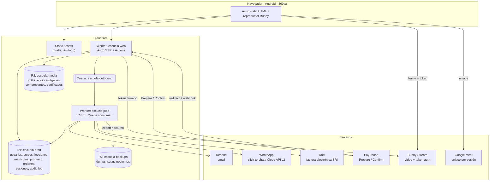

# 01 — System Architecture

**Owner:** System Architect agent · **Date:** 2026-09-06 · **Status:** proposal for founder review
**Stack (locked by `00-locked-decisions.md`):** Astro 7.3.1 · `@astrojs/cloudflare@14.3.0` · Workers Static Assets · D1 · R2 · Tailwind v4 · Node ≥22.12
**Honest cost floor:** $5 Workers Paid + ~$2–8 R2 + ~$1–3 Bunny Stream = **$8–16/month**. Not $0. See §9.

Placeholder domain throughout: `escuela.ec`. Brand agent owns the real name.

---

## 1. Rendering strategy

`output: 'static'` (Astro's default), with `export const prerender = false` on the ~24 routes that need a request. This is not a style preference — it is the single largest cost lever on Cloudflare. **Static assets are free and unlimited and do not count against the 100,000 requests/day Worker quota**; anything the Worker renders does. Inverting this (`output: 'server'`) would put every marketing pageview on the meter.

Never set `run_worker_first`. Past the request cap, `run_worker_first` routes return **429** instead of falling back to static assets — a traffic spike would take the marketing site down, not just the app.

**The trap nobody warns you about: the logged-in header.** If you `server:defer` the site header to show "Hola, María", every static marketing pageview costs a Worker request and you have thrown away the free static tier. Instead use a **dual-cookie split**:

| Cookie | Contents | Flags | Read by |
|---|---|---|---|
| `__Host-ec_session` | Better Auth session token. The only credential. | `HttpOnly; Secure; SameSite=Lax; Path=/` | Worker only |
| `ec_hint` | `{n:"María", r:"alumno", i:"MR"}` — display only, **zero** security value | `Secure; SameSite=Lax; Path=/`, not HttpOnly | 400-byte inline script |

A 12-line inline script reads `ec_hint` and swaps the header's "Ingresar" for the avatar. Cost: 0 Worker requests, 0 layout shift. Anyone forging `ec_hint` gets a lying header and no data.

**Server islands (`server:defer`)** are then reserved for places where personalization is worth a request:

- `/` → "Continuá donde quedaste" strip (one island, only rendered for hinted-logged-in visitors, gated client-side)
- `/cursos/[slug]/` → the CTA block: `Inscribirme · $X` vs `Ya estás inscrito → Ir al curso` vs `Pago pendiente`
- `/profesores/[slug]/` → live availability slots for 1:1 booking

Each island gets a `fallback` that renders the anonymous state, so the static HTML is complete and indexable before the island resolves. **Google indexes the fallback, not the island** — so never put SEO-relevant content in an island.

**Astro Actions** carry every mutation (`src/actions/index.ts`): `auth.*`, `checkout.*`, `progreso.*`, `estudio.*` (teacher studio), `admin.*`. Typed input via Zod, no hand-rolled `/api/*` routes except three that must accept foreign POSTs: `/api/webhooks/payphone`, `/api/auth/[...all]` (Better Auth handler), `/api/media/token`. In Astro 7's advanced routing pipeline (`src/fetch.ts`) auth resolution runs **before** Actions, so `context.locals.auth` is populated for every Action without per-action boilerplate.

**SEO surface is 100% static, permanently.** Course catalogue, teacher pages, blog, problem-query landing pages, JSON-LD, sitemap. Course pages rebuild on publish via a deploy hook. That means a course price change takes one CI build (~2 min) to go live — accepted, and cheaper than SSR-ing 200 catalogue pages forever.

---

## 2. Auth & sessions

**Choice: Better Auth 1.7.3 with its native Cloudflare D1 adapter.** Rejected alternatives, with reasons:

| Option | Verdict |
|---|---|
| Better Auth + D1 | **Chosen.** Native D1 since v1.5. Sessions in D1 = 100,000 writes/day vs KV's 1,000/day. Self-hosted → student PII stays in one jurisdiction we chose, which matters for the LOPDP transfer registration. |
| Astro Sessions (adapter default) | **Rejected.** The Cloudflare adapter silently wires Astro Sessions to KV (binding `SESSION`). **1,000 KV writes/day ≈ 300–1,000 logins/day**, failing silently mid-afternoon, resetting at 00:00 UTC = 19:00 Ecuador — i.e. exactly at the start of evening study hours. KV is also eventually consistent (~60 s), so a Quito→Miami PoP hop can show a just-logged-in student as logged out. |
| Hand-rolled sessions | **Rejected.** Better Auth gives verification, reset, rate limits, impersonation and OAuth for free. Lucia is deprecated (npm deprecation notice, dead since Mar 2025) — do not install it. |
| Clerk / WorkOS / Auth0 free tiers | **Rejected for students.** Generous limits, but every student identity leaves for a third US processor, adding a second international-transfer registration under Resolución SPDP-SPD-2026-0004-R for no benefit. Reconsider only if auth engineering becomes the critical path. |
| Cloudflare Access | **Rejected for students, viable for staff.** Free tier is 50 users and **hard-blocks at 51**. Fine for gating `/admin/*` to Karel + 3 teachers if we ever want a second factor; catastrophic pointed at alumnos. Also, Workers behind Access lose the Cache API. |

**Password hashing is the reason the free tier dies.** Better Auth's default is `@noble/hashes/scrypt`, pure JS, **~80 ms CPU on workerd** — 8× the free plan's 10 ms hard limit, per better-auth issue #8860. Two required mitigations:

1. Buy Workers Paid ($5/mo → 30 s CPU default). Non-negotiable for real passwords.
2. Override `emailAndPassword.password.{hash,verify}` to call **`node:crypto.scryptSync`** (native, behind the `nodejs_compat` compatibility flag) with `N=16384, r=8, p=1, keylen=64`. Cuts hashing to a few ms and removes the tail-latency risk on cheap Android phones' login attempts.

**Session policy:** 30-day expiry, `updateAge: 86400` (refresh the row at most once per 24 h — without this you write to D1 on *every* authenticated request and burn the 100k/day write budget). `freshAge: 900` so password/email changes require a recent login.

**Roles.** `usuarios.rol TEXT CHECK (rol IN ('alumno','profesor','admin'))` plus a separate `representantes` link table, because a guardian is a *relationship*, not a rank:

```
representantes(id, representante_user_id, alumno_user_id, parentesco,
               consentimiento_doc_id, consentimiento_at, revocado_at)
```

A guardian is a normal `alumno`-role account with rows here. This matters legally: LOPDP + RGLOPDP require the **legal representative's express consent** for any minor's sensitive data regardless of the child's age, so guardianship must be a first-class, auditable, revocable record from day one — not an `es_padre` boolean bolted on in v2. A user may hold `profesor` and also be enrolled as a student; teacher-ness lives in a `profesores` profile row, not in `rol`.

**Row-level authorization — D1 has no RLS, so we enforce it structurally.** Three layers, all cheap:

1. **Repository layer.** Every D1 query lives in `src/server/repo/*.ts`. Every exported function takes `ctx: AuthContext` as its **first parameter** and physically cannot be called without one. Ownership predicates live inside the repo function, never at the call site: `listarLeccionesDeCurso(ctx, cursoId)` always appends `AND EXISTS (SELECT 1 FROM matriculas m WHERE m.curso_id = ? AND m.alumno_id = ? AND m.estado='activa')`.
2. **CI guard.** A grep in the pipeline fails the build on `env.DB.prepare(` or `.batch(` appearing anywhere outside `src/server/repo/`. Crude, 5 lines, catches 100% of the mistake it targets.
3. **`can()` policy module** (`src/lib/authz.ts`) for the decisions that aren't a SQL predicate — can this teacher publish, can this guardian read this therapy note. Pure functions, unit-tested, no I/O.

**Impersonation.** Better Auth's admin plugin, extended: `sessions.impersonado_por_user_id` set on the session row; a permanent red `<Banner>` in the layout while set; a 60-minute hard cap; and a mandatory `motivo` string written to `audit_log`. **Hard rule: impersonation is blocked for any account linked to a minor in the therapy vertical** — LOPDP Art. 25 makes that sensitive + minors' + health data simultaneously, and a support agent browsing it casually is exactly the "insufficient organizational safeguard" the SPDP fined LigaPro USD 259,644 for.

**Rate limiting**, layered because the free WAF plan gives only **one** rate limiting rule:
- The one free WAF rule → `http.request.uri.path contains "/api/auth/"` at 10 req/min per IP.
- **Cloudflare Turnstile** (free, unlimited) on registro, login-after-2-failures, and recuperar-clave.
- D1 table `auth_intentos(clave_hash, tipo, ventana_inicio, conteo)` keyed on `sha256(email)` and `sha256(ip)`, exponential backoff 1s→2s→4s→…→300s. Costs ~2 rows written per failed login; irrelevant against 100k/day.

**Email verification & reset** via **Resend free tier: 3,000/month but capped at 100/day** — the daily cap is the binding constraint and it *pauses sending* rather than charging. 100/day covers launch (3 teachers, first cohorts) but breaks on the first real marketing push. Trigger to upgrade in §9. Verification is required before enrolment can be granted; reset tokens are single-use, 30 min, stored hashed.

---

## 3. Route map

`lang="es-EC"`, unprefixed routes, **no i18n layer** (locked, D1). If English is ever added, it goes at `/en/` via Astro's `i18n` config with `prefixDefaultLocale: false` — a retrofit that touches routing and the sitemap only, because we never hard-code Spanish strings into components (all copy in `src/content/copy/es-EC.ts`).

| Path | Render | Auth | Purpose |
|---|---|---|---|
| `/` | static | — | Home. Server island: "continuá donde quedaste". |
| `/cursos/` | static | — | Catalogue index, filterable client-side. |
| `/cursos/[categoria]/` | static | — | `ingles`, `musica`, `programacion`, `terapia-de-lenguaje`. SEO pillar pages. |
| `/cursos/[categoria]/[slug]/` | static | — | Course sales page. Island: enrolment CTA. |
| `/profesores/` , `/profesores/[slug]/` | static | — | Teacher directory + profile. Credentials visible (trust signal, and ACESS/SENESCYT registry number for the therapy vertical). |
| `/blog/` , `/blog/[slug]/` | static | — | SEO problem-query content ("mi hijo no habla bien"). |
| `/precios/`, `/como-funciona/`, `/preguntas-frecuentes/` | static | — | Conversion + Ley 67 pre-purchase disclosure. |
| `/legal/{terminos,privacidad,reembolsos}/` | static | — | LOPDP + consumer-law surface. |
| `/ingresar/`, `/registro/`, `/recuperar-clave/`, `/verificar/` | **SSR** | anon | Auth. Turnstile-gated. |
| `/api/auth/[...all]` | **SSR** | — | Better Auth handler. |
| `/mi-aprendizaje/` | **SSR** | alumno | Student dashboard. |
| `/mi-aprendizaje/[cursoSlug]/` | **SSR** | matriculado | Course outline + progress. |
| `/mi-aprendizaje/[cursoSlug]/[leccionSlug]/` | **SSR** | matriculado | **Lesson player.** Mints media token per request. |
| `/mi-aprendizaje/certificados/` | **SSR** | alumno | Certificate list + R2 signed download. |
| `/mis-clases/` | **SSR** | alumno | Live-session bookings + Meet links. |
| `/checkout/[orderId]/` | **SSR** | alumno | Order review, method choice, cédula capture ≥ $50. |
| `/pago/retorno` | **SSR** | **anon** | PayPhone redirect landing. Must work without a session. |
| `/pago/transferencia/[orderId]/` | **SSR** | alumno | Bank details + comprobante upload. |
| `/api/webhooks/payphone` | **SSR** | shared secret | Second confirmation path. |
| `/estudio/` | **SSR** | profesor | Teacher studio home. |
| `/estudio/cursos/[id]/{contenido,precios,publicar}` | **SSR** | profesor(owner) | Course/module/lesson CRUD, reorder, draft→publish. |
| `/estudio/subir/` | **SSR** | profesor | Issues Bunny TUS presigned upload signature. |
| `/estudio/alumnos/` | **SSR** | profesor | Roster + progress for own courses only. |
| `/estudio/agenda/` | **SSR** | profesor | Availability rules, bookings. |
| `/admin/` | **SSR** | admin | Ops home. |
| `/admin/pagos/pendientes/` | **SSR** | admin | **Manual transfer approval queue.** |
| `/admin/usuarios/`, `/admin/auditoria/` | **SSR** | admin | User admin, impersonation launch, audit log. |
| `/representante/` | **SSR** | representante | Guardian view: child's progress, consents, session notes. **v2.** |

~24 SSR routes. At 20–40 dynamic requests per student session, 100k requests/day ≈ 2,500–5,000 sessions/day before the free cap — but we are on paid (10M/month), so the real headroom is ~10,000 sessions/day at $5.

---

## 4. Application boundaries

Three Workers, one D1, two R2 buckets, one Queue. Not a monolith and not microservices — the split is drawn on **failure isolation and CPU budget**, not on domain purity.



**`escuela-web`** — the Astro app. Everything a human waits on.

**`escuela-jobs`** — separate Worker, same D1 binding. Reasons it is separate, not a cron handler inside the Astro Worker: (a) cron on the **free** plan gets only 10 ms CPU — nightly rollups do not fit, and even on paid a 15-minute job sharing a bundle with the site is a deployment hazard; (b) a runaway job cannot take the site down; (c) the jobs bundle stays out of the 64 MiB web bundle. Free cap is 5 cron triggers/account, which is exactly enough:

| Cron | Schedule | Job |
|---|---|---|
| `*/10 * * * *` | every 10 min | **Reconciliar pagos** — orders `pendiente` older than 8 min → query PayPhone status → mark `reversado` / escalate. |
| `0 7 * * *` | 02:00 EC | **Backup** — `d1 export` → gzip → R2 `escuela-backups`. |
| `30 7 * * *` | 02:30 EC | **Rollups** — `progreso_curso` denormalized percentages, streaks, certificate eligibility. |
| `0 13,23 * * *` | 08:00/18:00 EC | **Recordatorios** — class reminders and payment nudges into the queue. |
| `*/15 * * * *` | every 15 min | **Vigilancia** — anomaly checks → alert Karel (§8). |

**Queues** (`escuela-outbound`, 10,000 ops/day free → 1M/month paid) carries every third-party side-effect: Resend sends, WhatsApp messages, Dátil invoice issuance, certificate PDF generation. **Gotcha: free-tier Queues retain messages for only 24 hours** (14 days on paid). If a consumer breaks over a weekend on free, invoices are silently lost. Since we are on Workers Paid anyway, set `max_retries: 5` with a dead-letter queue `escuela-dlq` and alert on DLQ depth > 0.

**Not separate Workers:** media token minting (a 3-line HMAC, stays in `escuela-web`) and search (client-side Pagefind over the static catalogue, zero Worker cost).

---

## 5. Media pipeline

**Deliberate deviation from "Cloudflare only", stated loudly:** video goes to **Bunny Stream**, not Cloudflare Stream and not self-hosted HLS on R2.

| Option | 100 h library + 400 watch-h/mo | Engineering |
|---|---|---|
| Cloudflare Stream | **~$54/mo** ($5/1,000 min stored + $1/1,000 min delivered) | Lowest. But **no DRM at all**, and its watermark is a static PNG fixed at upload — never per-student. |
| Self-hosted HLS on R2 | ~$3.20/mo | **Weeks.** Hand-run ffmpeg ladders, write signed URLs, build the player, and a Worker in the segment path costs ~610 requests per watch-hour. |
| **Bunny Stream** | **~$3.22/mo** (Volume network) | **Lowest of the cheap options.** Free transcoding, free ABR ladder, free embed-view **token auth**, free **MediaCage Basic** AES encryption, and a player — at a $1/mo minimum. |

Cloudflare Stream is ~17× the cost for a strictly worse security story. R2 stays in the architecture for everything that is *not* video: PDFs, audio-only renditions, images, payment comprobantes, certificates — comfortably inside the 10 GB free tier.

⚠️ **Verify before committing:** Bunny's South America *Standard* network is **$0.045/GB — 9× the $0.005/GB Volume rate**. Stream is documented as defaulting to the high-volume tier, but confirm which tier Ecuadorian viewers actually bill at. Getting this wrong turns $7/month into $45/month.

**Upload path (teacher):**
1. Teacher at `/estudio/subir/` picks a file. Browser sends filename/size to Action `estudio.prepararSubida`.
2. Worker creates the Bunny video object via API, writes a `lecciones` row with `estado='subiendo'`, and returns a **TUS resumable upload signature** (`sha256(libraryId + apiKey + expiration + videoId)`).
3. **Browser uploads directly to Bunny.** The Worker never touches the bytes — it cannot: Workers have a 128 MB memory ceiling and a CPU budget, and a 2 GB lesson video would be impossible to proxy. TUS also survives the dropped connections that Ecuadorian mobile uploads will produce.
4. Bunny transcodes (free, standard encoder) and calls our webhook → `lecciones.estado='listo'`, `duracion_seg`, thumbnail URL.
5. Teacher previews in draft, then publishes → CI rebuild → the course page goes static.

**Playback path (student), every access check in order:**
1. GET `/mi-aprendizaje/[curso]/[leccion]/` → SSR.
2. Session valid → `matriculas` row exists, `estado='activa'`, `expira_at` in the future → `lecciones.curso_id` matches the URL's course. All three inside one repo function, one D1 query.
3. Concurrent-device check: `sesiones` active count ≤ 2. A third login evicts the oldest and writes `system_events`.
4. Worker mints an **embed-view token**, `expires = now + 6h`.
5. Renders `<iframe src="https://iframe.mediadelivery.net/embed/{lib}/{videoId}?token=…&expires=…">`, with Bunny `allowedReferrers` locked to `escuela.ec`.
6. **Per-student watermark**: a DOM overlay rendering `María Ramírez · ****4821 · 2026-09-06` at 35% opacity, repositioning every 20 s.

**What actually stops sharing, ranked honestly:**
- Expiring tokens + referrer lock stop ~90% of real leakage — the copy-the-URL-into-a-WhatsApp-group attack. Free.
- MediaCage Basic defeats yt-dlp and download managers. Free.
- The watermark makes any screen-recorded leak **traceable to one paying account**. This is the deterrent, not the block.
- Account-sharing detection in D1 (concurrent sessions, device count, IP/geo anomaly) is worth more per dollar than any video technology, and costs $0.
- **Accept as unavoidable:** screen recording, a phone pointed at the screen, and manifest extraction inside the 6-hour window. Real Widevine/FairPlay DRM has a $99–100/month floor and still does not stop a phone camera. Do not buy it.

**Bandwidth is the student's cost, not ours.** Out-of-bundle mobile data in Ecuador is ~$0.10/MB (≈$100/GB); a typical $10 prepaid bundle is 8 GB. One hour of 720p (~1,048 MB) is 13% of that bundle. Therefore: **default the player to 480p**, never "auto-highest"; ship a 240p rung; ship an **audio-only rendition at 64 kbps (29 MB/hour)** for language and theory lessons; keep lessons 6–10 minutes; and display "≈45 MB" next to every lesson in the UI. Offer downloadable PDFs and audio, never downloadable video — a downloadable video is a published video.

**Live classes: a URL in a column.** `sesiones_vivo.enlace_reunion` holds a Google Meet link, rendered behind auth. Free, unlimited 1:1 (24 h), 60 min for 3+, no install on Android, native es-419 UI. **Zoom Basic is disqualified** — its 40-minute cap has applied to 1:1 meetings since 2 May 2022 per Zoom's own KB, despite many 2026 comparison sites still claiming otherwise. Embedding WebRTC buys nothing a student values and costs per participant-minute; defer it until the therapy vertical needs recorded, guardian-visible sessions (§9).

---

## 6. Payment flow

**Stripe does not exist here.** Not as a merchant country, not in preview, not even as a Global Payouts destination as of the March-2026 changelog. Primary rail is **PayPhone** (5% + IVA = **5.75% effective**, no monthly fee, instant settlement, diferido 3/6/9/12 built in, RUC-only onboarding). Secondary rail is **manual bank transfer** at ~$0.35 cost. Both terminate in **one** enrolment-granting function.

**The load-bearing finding that shapes this whole section:** PayPhone's Botón de Pago is a **browser redirect, and if your server does not call `POST /api/button/V2/Confirm` within 5 minutes of the payment, PayPhone automatically reverses the transaction.** This inverts the usual webhook failure mode. The default failure is *the money goes back*, which is safe — but it means the confirmation cannot be a leisurely async job. It must run synchronously in the redirect handler, with the webhook and a cron as backups.

```mermaid
sequenceDiagram
  autonumber
  participant A as Alumno (Android)
  participant W as escuela-web (Worker)
  participant D as D1
  participant P as PayPhone
  participant Q as Queue escuela-outbound
  participant J as escuela-jobs

  A->>W: Action checkout.iniciar(cursoId)
  W->>D: INSERT ordenes (estado='pendiente',<br/>client_tx_id ≤15 chars, monto_cent)
  Note over W: cédula obligatoria si total ≥ $50<br/>(factura consumidor final irreversible desde 1-ene-2026)
  W->>P: POST /api/button/Prepare<br/>{amount, amountWithTax, tax, clientTransactionId,<br/>responseUrl, storeId, currency:"USD"}
  P-->>W: {paymentId, payWithCard, payWithPayPhone}
  W-->>A: 302 → formulario PayPhone
  A->>P: paga (tarjeta / app / diferido 3-6-9-12)
  P-->>A: 302 → /pago/retorno?id=…&clientTransactionId=…
  A->>W: GET /pago/retorno
  rect rgb(255,240,230)
    Note over W,P: ⏱ ventana de 5 minutos —<br/>sin Confirm, PayPhone reversa sola
    W->>P: POST /api/button/V2/Confirm {id, clientTxId}
    P-->>W: {transactionStatus:"Approved", authorizationCode, …}
  end
  W->>D: db.batch([ UPDATE ordenes SET estado='pagado',<br/>payphone_tx_id (UNIQUE);<br/>INSERT OR IGNORE matriculas;<br/>INSERT audit_log ])
  W->>Q: encolar {email_bienvenida, whatsapp, factura_datil}
  W-->>A: "Pago aprobado" + botón "Ir a mi curso"
  P--)W: POST /api/webhooks/payphone (segunda vía, idempotente)
  J->>D: cron */10 — órdenes pendientes > 8 min
  J->>P: consultar estado → 'reversado' o escalar a admin
```

**Idempotency.** `ordenes.payphone_tx_id` carries a `UNIQUE` constraint; enrolment insertion is `INSERT OR IGNORE` on `UNIQUE(alumno_id, curso_id)`. All of it goes through `otorgarMatricula(ctx, ordenId)` — the **only** function in the codebase that creates a `matriculas` row. Redirect handler, webhook, cron reconciliation, and the admin manual-approval button all call it. Running it five times produces one enrolment, one invoice request, one welcome email.

**Webhook verification.** PayPhone's Notificación Externa posts JSON to a URL we configure. Because it does not ship a documented signature scheme we control, treat it as **untrusted**: it is a *trigger*, never a source of truth. On receipt we ignore the body's amounts entirely and re-call `Confirm` with the `id`, then grant from PayPhone's own response. Reject any request whose `clientTransactionId` has no matching `ordenes` row. Add a shared-secret path segment to the webhook URL as cheap noise reduction.

**When the redirect never arrives** (browser closed, mobile data died mid-payment — a common Ecuadorian reality): PayPhone auto-reverses at T+5min and the student was not charged. The cron catches the order, marks it `reversado`, and queues a WhatsApp message: *"Tu pago no se completó y no se te cobró. Podés intentarlo de nuevo acá."* If the cron finds a transaction that PayPhone reports as Approved despite no Confirm, it **escalates to `/admin/pagos/pendientes` and does not auto-grant** — a payment that survived an auto-reversal is anomalous and deserves a human.

**Bank transfer / depósito fallback:**
1. Student picks *Transferencia o depósito* → order `pendiente_transferencia`, shown bank details plus a reference code (`ORD-7K2M`) and a WhatsApp deep link.
2. Student uploads the comprobante (≤5 MB, jpg/png/pdf) via a presigned R2 PUT → `comprobantes` row.
3. `/admin/pagos/pendientes/` shows proof, order, expected amount, and student.
4. Admin approves → `otorgarMatricula()` → identical downstream.

**Hard rule, written into the admin UI as a required radio button:** approval requires seeing the money in the bank's own app or statement — `verificado_contra ∈ {estado_cuenta, app_banco}`. **Never grant access on a WhatsApp screenshot.** Edited-receipt fraud is the documented attack pattern in Ecuadorian e-commerce, and a screenshot is not evidence.

**Invoicing.** Dátil (REST, `X-Key`/`X-Password`, $25–340/year including API) is called from the queue consumer, not the request path — SRI submission latency must never block a student seeing their course. Since 1 Jan 2026 transmission must be immediate and consumidor-final invoices are **irreversible once transmitted**, so the queue job runs within seconds but the *order* is already granted. **Blocking pre-launch dependency:** active RUC + firma electrónica must exist before the first legal sale. Whether we charge 15% IVA at all depends on the RIMPE / Operador de Capacitación decision — see Open Questions.

---

## 7. Environments, secrets, CI/CD

Three environments in one `wrangler.jsonc`:

| Env | Worker | D1 | R2 | Domain |
|---|---|---|---|---|
| local | `wrangler dev` (Miniflare) | `escuela-local` (`--local`, on-disk SQLite) | local dir | `localhost:4321` |
| preview | `escuela-web-preview` | `escuela-preview` (seeded, fake data only) | `escuela-media-preview` | `preview.escuela.ec` |
| production | `escuela-web` | `escuela-prod` | `escuela-media` | `escuela.ec` |

**Preview D1 never contains real student data.** A seed script generates fictitious alumnos. This is not hygiene theatre — real minors' records in a preview environment is a reportable LOPDP exposure.

⚠️ **Irreversible decision, make it before `d1 create`:** D1's `location_hint` and `jurisdiction` can only be set **at creation and can never be changed**. There is no Latin American option. Recommendation: `--location-hint=enam` (eastern North America — measured Quito→Miami RTT is 49 ms, vs 169 ms to Madrid). Do **not** set `jurisdiction: eu` unless the data-protection lawyer specifically argues that EU residency strengthens the transfer position under Resolución SPDP-SPD-2026-0004-R; it costs ~120 ms on every uncached query for every Ecuadorian student. Either way, **every student record leaves Ecuador** and must be registered as an international transfer with RIPD standard contractual clauses.

**Migrations.** `wrangler d1 migrations apply` in CI, on `main` only, **before** the Worker deploy. Migrations are **additive-only** (add column → backfill → a later migration drops), because D1's only rollback is a Time Travel restore that is *destructive and in-place* — Time Travel cannot fork to a new database. Migration files are `migrations/0001_usuarios.sql` … numbered, never edited after merge.

**Secrets** via `wrangler secret put --env production`, never in `wrangler.jsonc`, never in a committed `.env`:
`BETTER_AUTH_SECRET`, `PAYPHONE_TOKEN`, `PAYPHONE_STORE_ID`, `PAYPHONE_WEBHOOK_PATH_SECRET`, `BUNNY_STREAM_API_KEY`, `BUNNY_LIBRARY_ID`, `BUNNY_TOKEN_KEY`, `RESEND_API_KEY`, `DATIL_API_KEY`, `DATIL_CERT_PASSWORD`, `TURNSTILE_SECRET`, `ALERT_WEBHOOK_URL`.

**Deploy path Karel actually uses:** work on a branch → push → GitHub Actions runs `npm ci && astro check && npm test && astro build` and deploys to preview → Karel opens `preview.escuela.ec` on his phone → merge the PR → the same pipeline runs migrations then `wrangler deploy --env production`. **Karel never runs `wrangler deploy` from his laptop against production.** For risky releases, `wrangler versions upload` + `wrangler versions deploy --percentage 10` gives a gradual rollout with a one-command revert. CI budget: Workers Builds free is 3,000 build minutes/month, 1 concurrent build, 20-minute timeout — an Astro build of ~200 pages is ~2 minutes, so ~1,500 builds/month of headroom.

---

## 8. Observability & failure modes

**Two-tier logging, because logs expire and money does not.**

- **Workers Logs** (paid: 20M events/month, 7-day retention) for request-level structured JSON: `{evt, req_id, user_id, ruta, ms, d1_rows_read}`. Debugging only.
- **`system_events` table in D1** for anything with business or legal consequence: payment approved/failed/reversed, enrolment granted/revoked, refund, impersonation start/end, consent given/revoked, access to therapy records, video publish, login from a new device. Append-only, never deleted, indexed on `(tipo, creado_at)`. This is the record that survives.

**Active alerting** — the `*/15` cron queries five conditions and posts to Karel's WhatsApp/Telegram:
1. `ordenes` stuck `pendiente` > 30 min, count > 0.
2. Failed `Confirm` calls > 3 in the last hour.
3. `escuela-dlq` depth > 0.
4. Zero successful logins in the last 2 hours between 08:00–22:00 EC (a silent auth outage looks exactly like a quiet evening).
5. D1 daily rows-written > 70,000 (early warning before the 100k wall).

**What the limits actually do when exceeded** — this is the part people get wrong:

| Limit | Behaviour on breach |
|---|---|
| Workers 100k req/day (free) | **Error 1027**, or fail-open bypassing the Worker. `run_worker_first` routes get **429**, not a static fallback. Resets 00:00 UTC = **19:00 Ecuador**, the start of evening study hours. |
| Workers Paid 10M req/mo | Overage billed $0.30/million. No cliff. |
| KV 1,000 writes/day (free) | Writes fail. Sessions break silently. **Avoided entirely — sessions are in D1.** |
| D1 100k rows written/day | Writes rejected. |
| D1 5M rows **read**/day | **D1 bills rows *scanned*, not returned.** One unindexed scan of a 100k-row table costs 100,000 reads; 50 of those exhaust the day. Every FK and every WHERE column is indexed from migration 0001, and `EXPLAIN QUERY PLAN` is run on every list query before merge. |
| Queues free 24 h retention | Messages silently discarded. Paid = 14 days. |
| Resend 100/day | Sending **pauses**, no overage charge. |
| R2 10 GB free | Then $0.015/GB-month, zero egress. 500 GB = $7.50/mo. |

**Backup and restore — this is student money and children's records.**

- **Time Travel** is 30 days on paid, but **cannot clone or fork**. `wrangler d1 time-travel restore` is destructive and in-place. It is a disaster tool, not an inspection tool.
- Therefore: nightly `wrangler d1 export escuela-prod --remote --output=YYYY-MM-DD.sql`. Export is a **blocking** operation that halts reads and writes, so run it at 02:00 Ecuador. Gzip → R2 `escuela-backups` → **plus one copy off Cloudflare entirely** (Karel's Google Drive), because a compromised or suspended Cloudflare account takes the backups with it.
- Retention: 30 daily + 12 monthly.
- **Test the restore.** Once before launch and once per quarter: import last night's dump into a throwaway D1 and confirm login + enrolment + progress read correctly. An untested backup is not a backup.
- **LOPDP:** a personal-data breach must be notified to **both the SPDP and ARCOTEL within 5 days**. The runbook and the two contact routes go in `docs/runbook-incidentes.md` **before** launch, not after.

---

## 9. Scaling exits

| # | Trigger (measurable) | Move | Cost |
|---|---|---|---|
| 1 | **Day one, real passwords** | Workers Free → **Paid** | **$5/mo.** Buys 10 ms → 30 s CPU (scrypt is ~80 ms), 10M req/mo, D1 to 10 GB and 1,000 queries per invocation, Queues 1M/mo with 14-day retention, cron CPU 10 ms → 15 min, Time Travel 7 → 30 days. |
| 2 | **First teacher uploads > 10 GB** (week one) | R2 free → paid | $0.015/GB-mo, **zero egress**. 500 GB = $7.50/mo. |
| 3 | Resend hits 100 emails/day | Resend Pro | ~$20/mo, 50k/mo. |
| 4 | First confirmed video leak | Per-student watermark + concurrent-session cap in D1 | **$0** + one day of work. |
| 5 | Bunny delivery bill > $50/mo, or a second video vendor is one too many | Self-hosted HLS on R2 behind a custom domain, 1-year Edge TTL cache rules | ~$3.50/mo but **weeks** of engineering. Only worth it at 10× current traffic. |
| 6 | Therapy vertical needs recorded, guardian-visible sessions | LiveKit Cloud Ship (1,250 1:1 lesson-hours) or Daily at $0.004/participant-min + $0.01349/min recording | $50/mo. **Do not cross this line until the ACESS permit and the DPIA exist** — recording minors' therapy is the highest-risk data class in the project, and the cheapest compliance strategy is not creating the artefact. |
| 7 | > 5,000 daily sessions, or D1 p95 read latency hurts | D1 **read replication** via the Sessions API | $0 extra, but **public beta**, Worker-binding-only, and free-plan eligibility is undocumented. Verify before depending on it. |
| 8 | Card volume > ~$3,000/mo | PayPhone (5.75%) → Nuvei/Paymentez (~1.5% + IVA credit, 0.5% debit) | Saves ~4 points of gross margin ≈ $120/mo at $3k. Costs ~$6.50+IVA/mo carrier fee and 2–3 weeks of bank onboarding. |
| 9 | Revenue approaches **$20,000/year** | RIMPE Negocio Popular (0% IVA) → RIMPE Emprendedor | **A 15% IVA cliff mid-year**, plus monthly form 104 and mandatory e-invoicing. Model this before setting prices — it is a pricing decision, not a tax decision. |
| 10 | D1 single database > 8 GB, or > 60k rows written/day sustained | Split analytics into a second D1, or move to Hyperdrive + managed Postgres | Real migration work. Realistically years away for text data at ~1 KB/row. |

---

## Phasing

**MVP (weeks 1–8) — must ship for three teachers to sell.**
Auth (Better Auth + D1 + native scrypt + Turnstile + verification + reset). Roles alumno/profesor/admin. Static catalogue + teacher profiles + blog shell. Course/module/lesson data model with indexes. **Teacher studio: course CRUD, drag-reorder, TUS video upload to Bunny, draft→publish, preview** — this is the single biggest item (D4) and roughly 3 of the 8 weeks. Lesson player with token minting, enrolment check, 480p default, audio-only rendition. Progress tracking (debounced to 120 s + on-pause + on-unload — a naive 30 s heartbeat costs 120 D1 writes per student-hour). Checkout: PayPhone Prepare/Confirm + webhook + reconciliation cron + manual transfer queue. Dátil invoicing from the queue. Google Meet links on live sessions. Admin: users, pending payments, audit log, impersonation. Backups + the five crons + alerting.

**Cut from MVP to make room, explicitly:** quiz builder, certificates, guardian portal, 1:1 booking with availability rules, WhatsApp Cloud API (use click-to-chat links), search beyond client-side Pagefind, teacher payouts (Karel pays teachers by hand for the first cohorts — a spreadsheet is fine at three teachers).

**v2 (weeks 9–20).** Guardian/`representante` portal with a consent ledger. Certificates (R2 + signed download). Quiz/assessment builder. 1:1 booking (D1-native — Ecuador is UTC-5 with no DST, which removes the hardest part; and no off-the-shelf scheduler supports Ecuadorian payment rails). WhatsApp Cloud API for reminders. Teacher payout ledger. Diferido 3/6/9/12 exposed at checkout — **priced in**, since the merchant, not the bank, pays for interest-free installments (~+0.5–1% over base, up to ~5–8% on some schemes).

**Deferred indefinitely.** Embedded WebRTC. Real DRM. Native mobile apps (a PWA is enough). i18n/English. Self-hosted HLS. Live streaming. AI features.

---

## Open questions for the founder

1. **D1 jurisdiction — decide before the first `d1 create`, it is permanent.** `enam` (49 ms to Quito, US soil) or `eu` (169 ms, GDPR-adequate framing)? This needs the data-protection lawyer's read on Resolución SPDP-SPD-2026-0004-R, not mine.
2. **RIMPE Negocio Popular (0% IVA, hard $20k/year ceiling) or general regime with 15% IVA?** This changes checkout arithmetic, the invoicing integration, and every displayed price. Three teachers will breach $20k fast.
3. **Is the therapy vertical launching in v1 at all?** It requires SENESCYT + ACESS professional registration and an ACESS operating permit that the Oct-2025 Norma Técnica de Telesalud extends to remote delivery. This is a permit-or-don't-launch decision. My recommendation: **ship English, music and programming first; gate therapy behind the permit.**
4. **Who is the contracted external DPD?** Mandatory the moment one minor's data is processed (SPDP-SPD-2025-0028-R Art. 10.1), and Karel is legally barred from being it (Art. 15). Recurring cost, needs a name and a budget line.
5. **Are we recording anything at all in the therapy vertical?** Strong recommendation: **no.** Not creating the artefact is the cheapest possible compliance strategy.
6. **PayPhone Business account status** — is the RUC active and is the `storeId` issued? Everything in §6 blocks on this.
7. **Does the founder accept Bunny Stream as a second vendor**, given Cloudflare Stream is ~17× the price and self-hosting is weeks of work?
8. **Verify Bunny's South America billing tier** (Volume $0.005/GB vs Standard $0.045/GB). A 9× difference on the main recurring cost.
9. **Concurrent-device cap: 2 or 3?** Two is tighter against sharing; three avoids support tickets from a family with one phone and one tablet.
10. **Recorded-course catalogue vs monthly live-class packages** — the market evidence says packages sold over WhatsApp convert; D4 says build a course-authoring studio. Both are being built, but which one gets the homepage?

---

## Where this collides with other domains

- **Database agent.** Owns the schema; I have named tables (`usuarios`, `cursos`, `modulos`, `lecciones`, `matriculas`, `progreso`, `ordenes`, `comprobantes`, `sesiones`, `sesiones_vivo`, `representantes`, `audit_log`, `system_events`, `auth_intentos`) and constraints (`UNIQUE(alumno_id, curso_id)`, `UNIQUE ordenes.payphone_tx_id`) that the payment idempotency and authorization model depend on. **Non-negotiables:** Better Auth owns `user`/`session`/`account`/`verification` — its schema, not ours; every FK and every WHERE column indexed at migration 0001 because D1 bills rows *scanned*; nothing binary in D1 (2 MB row cap).
- **Tech-stack agent.** Must not reintroduce Astro 5, Cloudflare Pages, Lucia, or Stripe. Must confirm `nodejs_compat` (required for native scrypt) and Node ≥22.12. Owns the exact Better Auth plugin list.
- **Design agent.** Direct collisions: (a) the `ec_hint` cookie means the header renders its logged-out state for ~50 ms — design a swap that does not flash; (b) the 480p default and the "≈45 MB" per-lesson label are architecture requirements, not decoration; (c) the impersonation banner and the concurrent-device eviction notice need designed states; (d) 360px is the primary viewport (INEC: 32.7% of households own any computer; PCMI: mobile is 75% of e-commerce volume — **StatCounter's 79% desktop figure is an artifact, ignore it**).
- **SEO agent.** Hard boundary: **the SEO surface is 100% prerendered and nothing SEO-relevant may live inside a server island** — crawlers index the fallback. Slugs in this document (`/cursos/`, `/profesores/`, `/mi-aprendizaje/`, `/estudio/`) are proposals; SEO owns the final URLs, but changing an SSR route's path after launch invalidates the PayPhone `responseUrl` registered with the gateway. Also: publishing a course triggers a full CI rebuild, so a 500-page programmatic SEO expansion has a build-time cost.
- **Brand agent.** Owns the domain (`escuela.ec` is a placeholder), and it must be a Cloudflare zone — R2 media **must** be served from a real custom domain, never `r2.dev`, and Bunny's referrer lock is domain-bound.
- **Anyone proposing marketing automation.** Out of scope this round (D5), but the Queue and `system_events` are the hooks it will attach to.
