# 02 — Database Plan (Data Architect / DBA)

**Project:** Escuela online Ecuador (es-EC) · **Author role:** Data Architect / DBA · **Date:** 2026-09-06
**Status:** proposal for the founder. DDL below is intended to be copy-pasteable into `migrations/`.

---

## 1. Engine choice: Cloudflare D1, with three databases

**Recommendation: Cloudflare D1 (SQLite), split into three databases.** Not one, not Postgres.

| Database | Purpose | Creation flags | Backed up? |
|---|---|---|---|
| `escuela-core` | Everything transactional: identity, catalog, enrolments, money, bookings, content | `--location=enam` (Quito→Miami RTT ≈ 49 ms measured) | Yes, nightly |
| `escuela-clinico` | Therapy vertical only: consents, intake, notes, goals | `--jurisdiction=eu` (latency irrelevant — one write per session) | Yes, nightly, separate key |
| `escuela-buscador` | FTS5 virtual tables only, fully rebuildable from `escuela-core` | `--location=enam` | **No — deliberately** |

### Why three, and why the FTS5 database is separate

This is the single most important structural decision in this document, and it comes from a verified D1 limitation:

> "Export is not supported for virtual tables, **including databases with virtual tables**." — [D1 import/export docs](https://developers.cloudflare.com/d1/best-practices/import-export-data/)

FTS5 *is* available in D1 (`CREATE VIRTUAL TABLE … USING fts5(…)` works; the SQL-support page lists "FTS5 module for full-text search (including `fts5vocab`)"). But **the moment you add one FTS5 table to `escuela-core`, `wrangler d1 export` stops working for the entire database and you lose your only downloadable backup.** Keeping search in its own throwaway database means you never have to choose between search and backups. `escuela-buscador` is never backed up because it is regenerated from `escuela-core` by a cron.

### Why D1 and not the alternatives

| Option | Verdict | Reasoning |
|---|---|---|
| **D1** | **Chosen** | Zero marginal cost inside the $5 Workers Paid plan Karel is already buying; native Worker binding (no HTTP hop, no connection pool); `wrangler d1 migrations` is first-party; Better Auth has native D1 support since v1.5. |
| Turso | Rejected for v1 | Genuinely better SQLite (embedded replicas, real branching). But it is a second vendor, a second bill, and a second outage surface for a 3-teacher launch. Revisit if D1 write quota becomes binding. |
| Neon/Postgres + Hyperdrive | Rejected | Real RLS and real full-text — the two things D1 lacks. But it adds a paid Neon tier, Hyperdrive config, cold-start pooling, and cross-continent latency from the Worker. Postgres is the right answer at ~5,000 students, not at 200. |
| Supabase | Rejected | Explicitly overridden by the founder's Astro + Cloudflare constraint (D2 in `00-locked-decisions.md`). |

### What D1 honestly costs us

Per **D6**, this is written against **Workers Paid ($5/mo) from day one** at a **20–200 student** target. Free-tier numbers appear only to mark where cliffs are, never as design constraints.

| Limitation | Real consequence at 20–200 students | Mitigation in this plan |
|---|---|---|
| **No row-level security** | A single missing `WHERE user_id = ?` leaks another child's therapy data. **This is the only D1 limitation that genuinely matters here** — it is a correctness problem, and it does not get better with money. | §5: compiler-enforced scoped repositories + CI grep + separate DB binding |
| **No interactive transactions** — only `batch()`, which "are SQL transactions… aborts or rolls back the entire sequence" | Order + order_items + payment must be one `db.batch()` array, never sequential awaits | §4 commerce; optimistic concurrency where a read must sit between writes |
| **SQLite type affinity** (a TEXT column happily stores a number) | Silent data drift; no `NUMERIC(10,2)` to lean on | `CHECK` constraints on every enum and every money column (`CHECK (amount_cents >= 0)`) |
| **No native full-text unless FTS5** | FTS5 works, but any virtual table in a database **breaks `wrangler d1 export` for that whole database** | Separate `escuela-buscador` DB (above). Not a quota decision — a backup-integrity one. |
| **Rows *scanned*, not returned, are billed** | **Not a cost problem at this scale** — see §8. It is a *latency* problem: a full scan from Ecuador against a cross-continent primary is slow, and D1 caps a query at 30 s. | Index for p95 latency, not for the bill |
| Max DB size 10 GB paid (500 MB free); 5 GB storage included, then $0.75/GB-mo | `audit_log` at ~146 MB/year means **~68 years** to fill 10 GB. Non-issue. | Prune >180 days for query speed if it ever matters; not scheduled for MVP |
| Time Travel 30 days (paid) | Point-in-time recovery window is a month | §9 |

**Expected D1 bill at 200 students: $0 marginal.** Everything sits inside the allowances already bought with the $5 Workers Paid plan (25 billion rows read/month, 50 million written/month, 5 GB storage included).

---

## 2. ORM recommendation: Drizzle ORM 0.45.2

**Use Drizzle ORM `0.45.2` for queries, `drizzle-kit 0.31.10` to *generate* SQL, and `wrangler d1 migrations apply` to *apply* it.**

| Candidate | Verdict |
|---|---|
| **Drizzle ORM 0.45.2** (published 2026-03-27) | **Chosen.** First-class `drizzle-orm/d1` driver, `db.batch()` maps directly onto D1's only transaction primitive, schema-as-TypeScript gives the discriminated-union types §5 depends on, and `drizzle-kit generate` emits numbered `.sql` files in exactly wrangler's migration format. Bundle impact is small enough for the 64 MiB Worker limit. |
| Kysely 0.29.5 + kysely-d1 0.4.0 | Rejected. Kysely itself is excellent, but the D1 dialect `kysely-d1` was last published **2025-04-19** — a single-maintainer adapter that is 17 months stale is the wrong dependency for the money path. |
| Raw SQL + `env.DB.prepare()` | Rejected as the default, kept as an escape hatch. Used deliberately for the 3–4 hot analytical queries where I want byte-exact control of the plan. |

Non-negotiable: **`drizzle(env.DB)` may only be called inside `src/server/db/`.** Enforced in CI (§5).

---

## 3. Key design calls

| Call | Decision | Justification |
|---|---|---|
| **Primary keys** | `TEXT PRIMARY KEY` holding a **UUIDv7 as 32-char dashless lowercase hex** | Sortable lexicographically by creation time, so `ORDER BY id` replaces an index on `created_at` — a direct rows-scanned saving. Generated in the Worker (`crypto.getRandomValues` + `Date.now()`), so no round-trip and no sequence. 32 bytes vs 8 for INTEGER; at our row counts that is ~30 MB of index bloat against a 500 MB cap — acceptable, and I would not accept it at 50M rows. Override Better Auth's generator via `advanced.database.generateId` so *all* IDs share one format. |
| **Public identifiers** | Never the PK. Courses, lessons and posts expose `slug TEXT UNIQUE` (`ingles-a1-conversacion`, `piano-desde-cero`) | SEO, and it stops enumeration of internal IDs. |
| **Money** | `INTEGER` cents, always. Column suffix `_cents`, always `CHECK (x >= 0)`. Never `REAL`. | Ecuador is dollarized; `currency TEXT NOT NULL DEFAULT 'USD' CHECK (currency='USD')` is kept as self-documenting armour. IVA rate stored **per order** as `iva_rate_bp INTEGER` (1500 = 15%) so a future rate change never retro-mutates a historical invoice. |
| **Timestamps** | `INTEGER` Unix epoch **seconds**, UTC, always. | Ecuador is UTC-5 **year-round with no DST**, so display is a constant `-5 h` offset applied in the app. Where a *local calendar date* must be indexed (bookings, "clases de hoy"), use a STORED generated column: `local_date TEXT GENERATED ALWAYS AS (date(starts_at,'unixepoch','-5 hours')) STORED` — deterministic, indexable, and turns a range scan into an equality lookup. |
| **Enums** | `CHECK` constraint if the set only changes with a code deploy (`status`, `role`, `channel`). Lookup **table** if a human changes it without deploying (`subject`, `category`, `tag`). | A CHECK is validated by the engine with no join and no extra round-trip; a lookup table buys runtime editability and costs a join. Split on *who changes the values*, not on taste. |
| **Soft deletes** | `deleted_at INTEGER NULL` on *authored content only* (`course`, `module`, `lesson`, `post`). **Never** on `payment`, `payment_event`, `invoice`, `audit_log` (immutable by law and by sanity). Users get `status`, not `deleted_at`. | Every index over a soft-deletable table is **partial**: `WHERE deleted_at IS NULL`. This keeps the index the size of the *live* data, so a course listing never pages through years of deleted drafts. |
| **JSON columns** | Allowed for: raw webhook payloads, quiz option arrays, intake-form answers, per-row settings. **Forbidden** for anything that appears in a `WHERE` or `JOIN`. | D1 ships SQLite's JSON extension, but a `json_extract()` filter cannot use an index and therefore scans the table. Rule of thumb for the team: *"if you'd ever filter on it, it's a column."* |
| **Multi-tenancy** | **No.** Single tenant. A teacher is **not** a tenant — they are a row, and `course.teacher_id` is the ownership axis. | Three teachers. A `tenant_id` on 40 tables and every composite index buys nothing and costs every query. Ownership is enforced at the query layer (§5), which is where it would have to be enforced anyway. |
| **Course versioning** | **Rejected.** No `course_versions` table. | Full tree versioning is a v3 feature that would double the authoring studio's complexity — already flagged in D4 as the largest scope risk. Instead: `lesson.status ∈ ('draft','published')` + a lightweight `lesson_revision` table that snapshots `body_md` on publish. That gives teachers undo without giving us a versioned graph. |

---

## 4. Full DDL

Better Auth owns the first four tables and generates them in **camelCase**; everything I own is **snake_case**. This seam is deliberate and visible — do not "tidy" it, or `better-auth` migrations will fight you.

> **Verified before publishing.** Every SQL block below was executed against SQLite 3.50.4 — **43 tables and 50 indexes in `escuela-core`, 7 tables and 9 indexes in `escuela-clinico`, zero errors** — and the load-bearing constraints were behaviour-tested, not just parsed:
>
> | Constraint | Test | Result |
> |---|---|---|
> | SRI buyer-ID rule | $49.99 without cédula / $50.00 without / $50.00 with | allowed / **blocked** / allowed |
> | `uq_booking_teacher_slot` | two bookings same teacher + instant, then cancel the first and rebook | **blocked**, then allowed |
> | `local_date` generated column | epoch `1757208600` = 01:30 UTC | `2025-09-06` — correctly rolls back to the previous *Ecuadorian* day |
> | Therapist credential gate | `can_teach_clinical=1` with no ACESS number | **blocked** |
> | Money integrity | negative `amount_cents`; duplicate webhook event id | **blocked**; **blocked** |
>
> D1 tracks upstream SQLite closely but is not byte-identical, so re-run `wrangler d1 migrations apply --local` before trusting these against production.

### 4.1 `escuela-core` — identity & access

```sql
-- migrations/0001_identity.sql
CREATE TABLE user (
  id            TEXT PRIMARY KEY,
  name          TEXT    NOT NULL,
  email         TEXT    NOT NULL UNIQUE,
  emailVerified INTEGER NOT NULL DEFAULT 0,
  image         TEXT,
  createdAt     INTEGER NOT NULL,
  updatedAt     INTEGER NOT NULL,
  -- additionalFields, declared in better-auth config with input:false
  phone_e164    TEXT,                       -- '+5939XXXXXXXX', WhatsApp is the channel
  locale        TEXT    NOT NULL DEFAULT 'es-EC',
  status        TEXT    NOT NULL DEFAULT 'active'
                        CHECK (status IN ('active','suspended','deleted')),
  is_minor      INTEGER NOT NULL DEFAULT 0 CHECK (is_minor IN (0,1)),
  birthdate     TEXT                        -- 'YYYY-MM-DD'; drives LOPDP minor rules
);
CREATE INDEX idx_user_phone  ON user(phone_e164) WHERE phone_e164 IS NOT NULL;
CREATE INDEX idx_user_status ON user(status);

CREATE TABLE session (
  id        TEXT PRIMARY KEY,
  userId    TEXT    NOT NULL REFERENCES user(id) ON DELETE CASCADE,
  token     TEXT    NOT NULL UNIQUE,
  expiresAt INTEGER NOT NULL,
  ipAddress TEXT,
  userAgent TEXT,
  createdAt INTEGER NOT NULL,
  updatedAt INTEGER NOT NULL
);
CREATE INDEX idx_session_user    ON session(userId);
CREATE INDEX idx_session_expires ON session(expiresAt);

CREATE TABLE account (
  id                    TEXT PRIMARY KEY,
  userId                TEXT NOT NULL REFERENCES user(id) ON DELETE CASCADE,
  accountId             TEXT NOT NULL,
  providerId            TEXT NOT NULL,
  password              TEXT,              -- scrypt hash; see CPU warning §9
  accessToken           TEXT,
  refreshToken          TEXT,
  idToken               TEXT,
  accessTokenExpiresAt  INTEGER,
  refreshTokenExpiresAt INTEGER,
  scope                 TEXT,
  createdAt             INTEGER NOT NULL,
  updatedAt             INTEGER NOT NULL,
  UNIQUE (providerId, accountId)
);
CREATE INDEX idx_account_user ON account(userId);

CREATE TABLE verification (
  id         TEXT PRIMARY KEY,
  identifier TEXT    NOT NULL,
  value      TEXT    NOT NULL,
  expiresAt  INTEGER NOT NULL,
  createdAt  INTEGER,
  updatedAt  INTEGER
);
CREATE INDEX idx_verification_identifier ON verification(identifier);

-- Roles are a join table, not a column: a person can be teacher AND guardian.
CREATE TABLE user_role (
  user_id    TEXT    NOT NULL REFERENCES user(id) ON DELETE CASCADE,
  role       TEXT    NOT NULL
             CHECK (role IN ('alumno','profesor','terapeuta','representante','admin')),
  granted_at INTEGER NOT NULL,
  granted_by TEXT REFERENCES user(id),
  PRIMARY KEY (user_id, role)
);
CREATE INDEX idx_user_role_role ON user_role(role);
```

### 4.2 Profiles and guardians

```sql
-- migrations/0002_profiles_guardians.sql
CREATE TABLE student_profile (
  user_id          TEXT PRIMARY KEY REFERENCES user(id) ON DELETE CASCADE,
  display_name     TEXT    NOT NULL,
  school_regime    TEXT    CHECK (school_regime IN ('sierra','costa')),  -- 2 calendars
  grade_level      TEXT,
  city             TEXT,                       -- 'Quito', 'Guayaquil', 'Cuenca'
  notes_public     TEXT,
  created_at       INTEGER NOT NULL,
  updated_at       INTEGER NOT NULL
);

CREATE TABLE teacher_profile (
  user_id            TEXT PRIMARY KEY REFERENCES user(id) ON DELETE CASCADE,
  slug               TEXT    NOT NULL UNIQUE,   -- 'maria-lopez'
  headline           TEXT    NOT NULL,          -- 'Profesora de inglés · 12 años'
  bio_md             TEXT    NOT NULL DEFAULT '',
  photo_asset_id     TEXT,
  years_experience   INTEGER CHECK (years_experience BETWEEN 0 AND 70),
  -- credentials: shown publicly, and legally load-bearing for the therapy vertical
  senescyt_reg_no    TEXT,                      -- SENESCYT título registration
  acess_reg_no       TEXT,                      -- ACESS health-professional registration
  acess_permit_no    TEXT,                      -- consultorio permiso de funcionamiento
  credentials_verified_at INTEGER,
  can_teach_clinical INTEGER NOT NULL DEFAULT 0 CHECK (can_teach_clinical IN (0,1)),
  -- payout details
  payout_bank        TEXT,
  payout_account_last4 TEXT CHECK (payout_account_last4 IS NULL
                                   OR length(payout_account_last4) = 4),
  payout_account_enc TEXT,                      -- AES-GCM ciphertext, see §6
  payout_id_number   TEXT,                      -- cédula/RUC, required to pay them
  revenue_share_bp   INTEGER NOT NULL DEFAULT 7000
                     CHECK (revenue_share_bp BETWEEN 0 AND 10000),  -- 7000 = 70%
  status             TEXT    NOT NULL DEFAULT 'active'
                     CHECK (status IN ('pending','active','paused')),
  created_at         INTEGER NOT NULL,
  updated_at         INTEGER NOT NULL,
  CHECK (can_teach_clinical = 0
         OR (acess_reg_no IS NOT NULL AND acess_permit_no IS NOT NULL))
);
CREATE INDEX idx_teacher_status ON teacher_profile(status);

-- Guardian ↔ minor. LOPDP: sensitive data of any minor ALWAYS needs the legal
-- representative's express consent, regardless of the child's age.
CREATE TABLE guardian_link (
  id                TEXT PRIMARY KEY,
  guardian_user_id  TEXT    NOT NULL REFERENCES user(id) ON DELETE CASCADE,
  ward_user_id      TEXT    NOT NULL REFERENCES user(id) ON DELETE CASCADE,
  relationship      TEXT    NOT NULL
                    CHECK (relationship IN ('madre','padre','tutor_legal','otro')),
  is_legal_rep      INTEGER NOT NULL DEFAULT 1 CHECK (is_legal_rep IN (0,1)),
  verified_at       INTEGER,
  created_at        INTEGER NOT NULL,
  revoked_at        INTEGER,
  UNIQUE (guardian_user_id, ward_user_id),
  CHECK (guardian_user_id <> ward_user_id)
);
CREATE INDEX idx_guardian_by_guardian ON guardian_link(guardian_user_id) WHERE revoked_at IS NULL;
CREATE INDEX idx_guardian_by_ward     ON guardian_link(ward_user_id)     WHERE revoked_at IS NULL;
```

### 4.3 Catalog and content

```sql
-- migrations/0003_catalog.sql
CREATE TABLE subject (                      -- lookup table: admin edits without deploy
  id    TEXT PRIMARY KEY,
  slug  TEXT NOT NULL UNIQUE,               -- 'ingles','musica','programacion','terapia-lenguaje'
  name  TEXT NOT NULL,                      -- 'Inglés','Música','Programación','Terapia de lenguaje'
  sort_order INTEGER NOT NULL DEFAULT 0
);

CREATE TABLE course (
  id             TEXT PRIMARY KEY,
  slug           TEXT    NOT NULL UNIQUE,
  teacher_id     TEXT    NOT NULL REFERENCES teacher_profile(user_id),
  subject_id     TEXT    NOT NULL REFERENCES subject(id),
  title          TEXT    NOT NULL,
  subtitle       TEXT,
  description_md TEXT    NOT NULL DEFAULT '',
  level           TEXT   CHECK (level IN ('principiante','intermedio','avanzado')),
  delivery        TEXT   NOT NULL DEFAULT 'grabado'
                  CHECK (delivery IN ('grabado','en_vivo','mixto','clinico')),
  cover_asset_id  TEXT,
  status          TEXT   NOT NULL DEFAULT 'draft'
                  CHECK (status IN ('draft','review','published','archived')),
  published_at    INTEGER,
  est_minutes     INTEGER CHECK (est_minutes IS NULL OR est_minutes > 0),
  -- SEO, owned by the SEO agent's field list
  seo_title       TEXT,
  seo_description TEXT,
  created_at      INTEGER NOT NULL,
  updated_at      INTEGER NOT NULL,
  deleted_at      INTEGER,
  CHECK (status <> 'published' OR published_at IS NOT NULL)
);
CREATE INDEX idx_course_published ON course(status, published_at DESC)
  WHERE deleted_at IS NULL AND status = 'published';
CREATE INDEX idx_course_teacher   ON course(teacher_id) WHERE deleted_at IS NULL;
CREATE INDEX idx_course_subject   ON course(subject_id, status) WHERE deleted_at IS NULL;

CREATE TABLE module (
  id         TEXT PRIMARY KEY,
  course_id  TEXT    NOT NULL REFERENCES course(id) ON DELETE CASCADE,
  title      TEXT    NOT NULL,
  sort_order INTEGER NOT NULL DEFAULT 0,
  created_at INTEGER NOT NULL,
  updated_at INTEGER NOT NULL,
  deleted_at INTEGER
);
CREATE INDEX idx_module_course ON module(course_id, sort_order) WHERE deleted_at IS NULL;

CREATE TABLE lesson (
  id             TEXT PRIMARY KEY,
  module_id      TEXT    NOT NULL REFERENCES module(id) ON DELETE CASCADE,
  course_id      TEXT    NOT NULL REFERENCES course(id) ON DELETE CASCADE, -- denormalised on purpose
  slug           TEXT    NOT NULL,
  title          TEXT    NOT NULL,
  body_md        TEXT    NOT NULL DEFAULT '',
  sort_order     INTEGER NOT NULL DEFAULT 0,
  duration_sec   INTEGER CHECK (duration_sec IS NULL OR duration_sec >= 0),
  is_free_preview INTEGER NOT NULL DEFAULT 0 CHECK (is_free_preview IN (0,1)),
  status         TEXT    NOT NULL DEFAULT 'draft'
                 CHECK (status IN ('draft','published')),
  published_at   INTEGER,
  created_at     INTEGER NOT NULL,
  updated_at     INTEGER NOT NULL,
  deleted_at     INTEGER,
  UNIQUE (course_id, slug)
);
CREATE INDEX idx_lesson_module ON lesson(module_id, sort_order) WHERE deleted_at IS NULL;
CREATE INDEX idx_lesson_course ON lesson(course_id, status)     WHERE deleted_at IS NULL;

CREATE TABLE lesson_asset (
  id            TEXT PRIMARY KEY,
  lesson_id     TEXT    NOT NULL REFERENCES lesson(id) ON DELETE CASCADE,
  kind          TEXT    NOT NULL
                CHECK (kind IN ('video','audio','pdf','image','zip','link')),
  provider      TEXT    NOT NULL DEFAULT 'r2'
                CHECK (provider IN ('r2','bunny','youtube','external')),
  provider_ref  TEXT    NOT NULL,   -- R2 key, Bunny videoId, or URL
  title         TEXT,
  bytes         INTEGER CHECK (bytes IS NULL OR bytes >= 0),
  duration_sec  INTEGER,
  -- Ecuador: show MB cost before playing. Prepaid data is ~$0.10/MB out of bundle.
  approx_mb_480p INTEGER,
  is_downloadable INTEGER NOT NULL DEFAULT 0 CHECK (is_downloadable IN (0,1)),
  sort_order    INTEGER NOT NULL DEFAULT 0,
  created_at    INTEGER NOT NULL,
  deleted_at    INTEGER
);
CREATE INDEX idx_asset_lesson ON lesson_asset(lesson_id, sort_order) WHERE deleted_at IS NULL;

CREATE TABLE lesson_revision (        -- cheap undo for the teacher studio (D4)
  id         TEXT PRIMARY KEY,
  lesson_id  TEXT    NOT NULL REFERENCES lesson(id) ON DELETE CASCADE,
  body_md    TEXT    NOT NULL,
  title      TEXT    NOT NULL,
  author_id  TEXT    NOT NULL REFERENCES user(id),
  created_at INTEGER NOT NULL
);
CREATE INDEX idx_revision_lesson ON lesson_revision(lesson_id, created_at DESC);
```

### 4.4 Learning: enrolment, progress, assessment, certificates

```sql
-- migrations/0004_learning.sql
CREATE TABLE enrollment (
  id           TEXT PRIMARY KEY,
  user_id      TEXT    NOT NULL REFERENCES user(id) ON DELETE CASCADE,
  course_id    TEXT    NOT NULL REFERENCES course(id) ON DELETE CASCADE,
  source       TEXT    NOT NULL DEFAULT 'compra'
               CHECK (source IN ('compra','cortesia','beca','admin')),
  order_id     TEXT,                             -- FK added in 0005
  status       TEXT    NOT NULL DEFAULT 'active'
               CHECK (status IN ('active','completed','expired','revoked')),
  starts_at    INTEGER NOT NULL,
  expires_at   INTEGER,                          -- NULL = lifetime access
  completed_at INTEGER,
  created_at   INTEGER NOT NULL,
  updated_at   INTEGER NOT NULL,
  UNIQUE (user_id, course_id)
);
CREATE INDEX idx_enroll_user   ON enrollment(user_id, status);
CREATE INDEX idx_enroll_course ON enrollment(course_id, status);

-- Composite PK: no surrogate id, no extra index. One row per student per lesson.
CREATE TABLE lesson_progress (
  user_id        TEXT    NOT NULL REFERENCES user(id) ON DELETE CASCADE,
  lesson_id      TEXT    NOT NULL REFERENCES lesson(id) ON DELETE CASCADE,
  course_id      TEXT    NOT NULL REFERENCES course(id) ON DELETE CASCADE, -- denormalised for §5 scoping
  position_sec   INTEGER NOT NULL DEFAULT 0 CHECK (position_sec >= 0),
  percent_bp     INTEGER NOT NULL DEFAULT 0 CHECK (percent_bp BETWEEN 0 AND 10000),
  completed_at   INTEGER,
  first_seen_at  INTEGER NOT NULL,
  updated_at     INTEGER NOT NULL,
  PRIMARY KEY (user_id, lesson_id)
);
CREATE INDEX idx_progress_resume ON lesson_progress(user_id, updated_at DESC);
CREATE INDEX idx_progress_course ON lesson_progress(course_id, user_id);

CREATE TABLE quiz (
  id            TEXT PRIMARY KEY,
  lesson_id     TEXT    NOT NULL REFERENCES lesson(id) ON DELETE CASCADE,
  title         TEXT    NOT NULL,
  pass_percent_bp INTEGER NOT NULL DEFAULT 7000
                  CHECK (pass_percent_bp BETWEEN 0 AND 10000),
  max_attempts  INTEGER CHECK (max_attempts IS NULL OR max_attempts > 0),
  created_at    INTEGER NOT NULL,
  updated_at    INTEGER NOT NULL
);
CREATE INDEX idx_quiz_lesson ON quiz(lesson_id);

CREATE TABLE quiz_question (
  id           TEXT PRIMARY KEY,
  quiz_id      TEXT    NOT NULL REFERENCES quiz(id) ON DELETE CASCADE,
  kind         TEXT    NOT NULL
               CHECK (kind IN ('opcion_unica','opcion_multiple','verdadero_falso','texto_corto')),
  prompt_md    TEXT    NOT NULL,
  options_json TEXT    NOT NULL DEFAULT '[]',    -- JSON: never filtered, never joined
  answer_json  TEXT    NOT NULL,                 -- JSON: correct key(s)
  points       INTEGER NOT NULL DEFAULT 1 CHECK (points > 0),
  sort_order   INTEGER NOT NULL DEFAULT 0
);
CREATE INDEX idx_qq_quiz ON quiz_question(quiz_id, sort_order);

CREATE TABLE quiz_attempt (
  id            TEXT PRIMARY KEY,
  quiz_id       TEXT    NOT NULL REFERENCES quiz(id) ON DELETE CASCADE,
  user_id       TEXT    NOT NULL REFERENCES user(id) ON DELETE CASCADE,
  attempt_no    INTEGER NOT NULL CHECK (attempt_no > 0),
  answers_json  TEXT    NOT NULL DEFAULT '{}',
  score_bp      INTEGER CHECK (score_bp IS NULL OR score_bp BETWEEN 0 AND 10000),
  passed        INTEGER CHECK (passed IN (0,1)),
  started_at    INTEGER NOT NULL,
  submitted_at  INTEGER,
  UNIQUE (quiz_id, user_id, attempt_no)
);
CREATE INDEX idx_attempt_user ON quiz_attempt(user_id, quiz_id);

CREATE TABLE certificate (
  id          TEXT PRIMARY KEY,
  user_id     TEXT    NOT NULL REFERENCES user(id) ON DELETE CASCADE,
  course_id   TEXT    NOT NULL REFERENCES course(id),
  serial      TEXT    NOT NULL UNIQUE,   -- printed + verifiable: 'EC-2026-000123'
  issued_at   INTEGER NOT NULL,
  pdf_r2_key  TEXT,
  revoked_at  INTEGER,
  UNIQUE (user_id, course_id)
);
CREATE INDEX idx_cert_serial ON certificate(serial);
```

### 4.5 Live sessions and bookings

```sql
-- migrations/0005_scheduling.sql
-- Weekly recurring availability. Ecuador is UTC-5 with no DST, so a rule is
-- just a weekday + local minute-of-day. This is why hand-building the scheduler is cheap.
CREATE TABLE availability_rule (
  id             TEXT PRIMARY KEY,
  teacher_id     TEXT    NOT NULL REFERENCES teacher_profile(user_id) ON DELETE CASCADE,
  weekday        INTEGER NOT NULL CHECK (weekday BETWEEN 0 AND 6),  -- 0 = domingo
  start_minute   INTEGER NOT NULL CHECK (start_minute BETWEEN 0 AND 1439),
  end_minute     INTEGER NOT NULL CHECK (end_minute BETWEEN 1 AND 1440),
  slot_minutes   INTEGER NOT NULL DEFAULT 45 CHECK (slot_minutes BETWEEN 15 AND 240),
  active_from    TEXT NOT NULL,     -- 'YYYY-MM-DD' local
  active_until   TEXT,
  created_at     INTEGER NOT NULL,
  CHECK (end_minute > start_minute)
);
CREATE INDEX idx_avail_teacher ON availability_rule(teacher_id, weekday);

CREATE TABLE availability_exception (   -- feriados, vacaciones, one-off extra slots
  id          TEXT PRIMARY KEY,
  teacher_id  TEXT    NOT NULL REFERENCES teacher_profile(user_id) ON DELETE CASCADE,
  local_date  TEXT    NOT NULL,
  kind        TEXT    NOT NULL CHECK (kind IN ('bloqueo','extra')),
  start_minute INTEGER CHECK (start_minute BETWEEN 0 AND 1439),
  end_minute   INTEGER CHECK (end_minute BETWEEN 1 AND 1440),
  reason      TEXT,
  UNIQUE (teacher_id, local_date, kind, start_minute)
);

CREATE TABLE booking (
  id             TEXT PRIMARY KEY,
  teacher_id     TEXT    NOT NULL REFERENCES teacher_profile(user_id),
  student_id     TEXT    NOT NULL REFERENCES user(id),
  booked_by_id   TEXT    NOT NULL REFERENCES user(id),   -- guardian books for a minor
  course_id      TEXT REFERENCES course(id),
  order_item_id  TEXT,                                   -- FK added in 0006
  kind           TEXT    NOT NULL DEFAULT 'clase'
                 CHECK (kind IN ('clase','demo','terapia')),
  starts_at      INTEGER NOT NULL,
  ends_at        INTEGER NOT NULL,
  local_date     TEXT GENERATED ALWAYS AS
                 (date(starts_at, 'unixepoch', '-5 hours')) STORED,
  meeting_url    TEXT,                       -- Google Meet link; v1 is a link, not an embed
  status         TEXT    NOT NULL DEFAULT 'pending'
                 CHECK (status IN ('pending','confirmed','completed','cancelled','no_show')),
  cancelled_by   TEXT REFERENCES user(id),
  cancel_reason  TEXT,
  created_at     INTEGER NOT NULL,
  updated_at     INTEGER NOT NULL,
  CHECK (ends_at > starts_at),
  CHECK (kind <> 'terapia' OR course_id IS NOT NULL)
);
-- Double-booking is impossible at the storage layer; cancelled slots free up again.
CREATE UNIQUE INDEX uq_booking_teacher_slot ON booking(teacher_id, starts_at)
  WHERE status IN ('pending','confirmed');
CREATE INDEX idx_booking_teacher_day ON booking(teacher_id, local_date);
CREATE INDEX idx_booking_student     ON booking(student_id, starts_at DESC);

CREATE TABLE attendance (
  booking_id   TEXT PRIMARY KEY REFERENCES booking(id) ON DELETE CASCADE,
  present      INTEGER NOT NULL CHECK (present IN (0,1)),
  minutes      INTEGER CHECK (minutes IS NULL OR minutes >= 0),
  marked_by    TEXT    NOT NULL REFERENCES user(id),
  marked_at    INTEGER NOT NULL,
  note_public  TEXT                       -- NON-clinical only. See §6.
);
```

### 4.6 Commerce

```sql
-- migrations/0006_commerce.sql
CREATE TABLE product (
  id          TEXT PRIMARY KEY,
  slug        TEXT    NOT NULL UNIQUE,
  kind        TEXT    NOT NULL
              CHECK (kind IN ('curso','paquete_clases','sesion_unica','suscripcion')),
  course_id   TEXT REFERENCES course(id),
  teacher_id  TEXT REFERENCES teacher_profile(user_id),
  title       TEXT    NOT NULL,
  sessions_included INTEGER CHECK (sessions_included IS NULL OR sessions_included > 0),
  status      TEXT    NOT NULL DEFAULT 'draft'
              CHECK (status IN ('draft','active','retired')),
  created_at  INTEGER NOT NULL,
  updated_at  INTEGER NOT NULL
);
CREATE INDEX idx_product_active ON product(status, kind);

CREATE TABLE price_point (
  id            TEXT PRIMARY KEY,
  product_id    TEXT    NOT NULL REFERENCES product(id) ON DELETE CASCADE,
  amount_cents  INTEGER NOT NULL CHECK (amount_cents >= 0),
  currency      TEXT    NOT NULL DEFAULT 'USD' CHECK (currency = 'USD'),
  iva_rate_bp   INTEGER NOT NULL DEFAULT 1500 CHECK (iva_rate_bp BETWEEN 0 AND 3000),
  iva_included  INTEGER NOT NULL DEFAULT 1 CHECK (iva_included IN (0,1)),
  label         TEXT,                         -- 'Mensual', 'Pago único'
  allows_diferido INTEGER NOT NULL DEFAULT 0 CHECK (allows_diferido IN (0,1)),
  min_diferido_cents INTEGER NOT NULL DEFAULT 5000,   -- PayPhone diferido floor: USD 50
  active_from   INTEGER NOT NULL,
  active_until  INTEGER
);
CREATE INDEX idx_price_product ON price_point(product_id, active_from DESC);

CREATE TABLE coupon (
  id             TEXT PRIMARY KEY,
  code           TEXT    NOT NULL UNIQUE,      -- 'REGRESOACLASES26'
  discount_kind  TEXT    NOT NULL CHECK (discount_kind IN ('percent','fixed')),
  percent_bp     INTEGER CHECK (percent_bp IS NULL OR percent_bp BETWEEN 1 AND 10000),
  amount_cents   INTEGER CHECK (amount_cents IS NULL OR amount_cents > 0),
  max_redemptions INTEGER,
  redeemed_count INTEGER NOT NULL DEFAULT 0 CHECK (redeemed_count >= 0),
  valid_from     INTEGER NOT NULL,
  valid_until    INTEGER,
  created_at     INTEGER NOT NULL,
  CHECK ((discount_kind = 'percent' AND percent_bp IS NOT NULL)
      OR (discount_kind = 'fixed'   AND amount_cents IS NOT NULL))
);

CREATE TABLE "order" (
  id              TEXT PRIMARY KEY,
  user_id         TEXT    NOT NULL REFERENCES user(id),
  number          TEXT    NOT NULL UNIQUE,          -- 'ORD-2026-000451'
  subtotal_cents  INTEGER NOT NULL CHECK (subtotal_cents >= 0),
  discount_cents  INTEGER NOT NULL DEFAULT 0 CHECK (discount_cents >= 0),
  iva_rate_bp     INTEGER NOT NULL CHECK (iva_rate_bp BETWEEN 0 AND 3000),
  iva_cents       INTEGER NOT NULL DEFAULT 0 CHECK (iva_cents >= 0),
  total_cents     INTEGER NOT NULL CHECK (total_cents >= 0),
  currency        TEXT    NOT NULL DEFAULT 'USD' CHECK (currency = 'USD'),
  coupon_id       TEXT REFERENCES coupon(id),
  status          TEXT    NOT NULL DEFAULT 'pending'
                  CHECK (status IN ('pending','paid','failed','cancelled','refunded')),
  -- SRI: buyer ID is mandatory at USD 50.00+ (IVA included). Encoded as a constraint.
  buyer_id_type   TEXT CHECK (buyer_id_type IN ('cedula','ruc','pasaporte','consumidor_final')),
  buyer_id_number TEXT,
  buyer_name      TEXT,
  buyer_email     TEXT,
  created_at      INTEGER NOT NULL,
  paid_at         INTEGER,
  updated_at      INTEGER NOT NULL,
  CHECK (total_cents < 5000
         OR (buyer_id_number IS NOT NULL AND buyer_id_type <> 'consumidor_final'))
);
CREATE INDEX idx_order_user   ON "order"(user_id, created_at DESC);
CREATE INDEX idx_order_status ON "order"(status, created_at DESC);

CREATE TABLE order_item (
  id             TEXT PRIMARY KEY,
  order_id       TEXT    NOT NULL REFERENCES "order"(id) ON DELETE CASCADE,
  product_id     TEXT    NOT NULL REFERENCES product(id),
  price_point_id TEXT    NOT NULL REFERENCES price_point(id),
  teacher_id     TEXT REFERENCES teacher_profile(user_id),   -- for payout attribution
  title_snapshot TEXT    NOT NULL,     -- never join to product for a receipt
  qty            INTEGER NOT NULL DEFAULT 1 CHECK (qty > 0),
  unit_cents     INTEGER NOT NULL CHECK (unit_cents >= 0),
  line_cents     INTEGER NOT NULL CHECK (line_cents >= 0),
  sessions_remaining INTEGER CHECK (sessions_remaining IS NULL OR sessions_remaining >= 0)
);
CREATE INDEX idx_item_order   ON order_item(order_id);
CREATE INDEX idx_item_teacher ON order_item(teacher_id);

CREATE TABLE payment (
  id                 TEXT PRIMARY KEY,
  order_id           TEXT    NOT NULL REFERENCES "order"(id),
  provider           TEXT    NOT NULL
                     CHECK (provider IN ('payphone','deuna','transferencia','paypal','efectivo')),
  provider_payment_id TEXT,
  method             TEXT    CHECK (method IN ('tarjeta_credito','tarjeta_debito',
                                               'transferencia','wallet','efectivo')),
  sri_payment_code   TEXT,               -- SRI Tabla 24: '01','16','17','19','20'
  amount_cents       INTEGER NOT NULL CHECK (amount_cents > 0),
  fee_cents          INTEGER NOT NULL DEFAULT 0 CHECK (fee_cents >= 0),
  net_cents          INTEGER NOT NULL DEFAULT 0,
  deferred_months    INTEGER CHECK (deferred_months IS NULL
                                    OR deferred_months IN (3,6,9,12)),
  status             TEXT    NOT NULL DEFAULT 'initiated'
                     CHECK (status IN ('initiated','authorized','captured','failed',
                                       'refunded','partially_refunded')),
  -- manual bank transfer: NEVER auto-approve from a WhatsApp screenshot
  proof_r2_key       TEXT,
  approved_by        TEXT REFERENCES user(id),
  approved_at        INTEGER,
  created_at         INTEGER NOT NULL,
  updated_at         INTEGER NOT NULL,
  UNIQUE (provider, provider_payment_id)
);
CREATE INDEX idx_payment_order  ON payment(order_id);
CREATE INDEX idx_payment_status ON payment(status, created_at DESC);

-- Append-only webhook log. The UNIQUE key IS the idempotency guarantee.
CREATE TABLE payment_event (
  id                TEXT PRIMARY KEY,
  provider          TEXT    NOT NULL,
  provider_event_id TEXT    NOT NULL,
  payment_id        TEXT REFERENCES payment(id),
  event_type        TEXT    NOT NULL,
  signature_ok      INTEGER NOT NULL DEFAULT 0 CHECK (signature_ok IN (0,1)),
  payload_json      TEXT    NOT NULL,     -- raw body, verbatim, for disputes
  processed_at      INTEGER,
  error             TEXT,
  received_at       INTEGER NOT NULL,
  UNIQUE (provider, provider_event_id)
);
CREATE INDEX idx_pevent_unprocessed ON payment_event(received_at) WHERE processed_at IS NULL;

CREATE TABLE refund (
  id            TEXT PRIMARY KEY,
  payment_id    TEXT    NOT NULL REFERENCES payment(id),
  amount_cents  INTEGER NOT NULL CHECK (amount_cents > 0),
  reason        TEXT    NOT NULL,
  status        TEXT    NOT NULL DEFAULT 'pending'
                CHECK (status IN ('pending','completed','failed')),
  requested_by  TEXT    NOT NULL REFERENCES user(id),
  created_at    INTEGER NOT NULL,
  completed_at  INTEGER
);
CREATE INDEX idx_refund_payment ON refund(payment_id);

CREATE TABLE invoice (            -- SRI factura electrónica, issued via Dátil
  id                  TEXT PRIMARY KEY,
  order_id            TEXT    NOT NULL REFERENCES "order"(id),
  provider            TEXT    NOT NULL DEFAULT 'datil' CHECK (provider IN ('datil','manual')),
  provider_doc_id     TEXT,
  sri_clave_acceso    TEXT UNIQUE,           -- 49 digits
  sri_autorizacion    TEXT,
  sri_estado          TEXT    CHECK (sri_estado IN ('pendiente','autorizado','rechazado','anulado')),
  secuencial          TEXT,                  -- '001-001-000000451'
  emitted_at          INTEGER,
  total_cents         INTEGER NOT NULL CHECK (total_cents >= 0),
  iva_cents           INTEGER NOT NULL CHECK (iva_cents >= 0),
  xml_r2_key          TEXT,
  pdf_r2_key          TEXT,
  error               TEXT,
  created_at          INTEGER NOT NULL,
  updated_at          INTEGER NOT NULL
);
CREATE INDEX idx_invoice_order  ON invoice(order_id);
CREATE INDEX idx_invoice_estado ON invoice(sri_estado, created_at DESC);

CREATE TABLE teacher_payout (
  id                 TEXT PRIMARY KEY,
  teacher_id         TEXT    NOT NULL REFERENCES teacher_profile(user_id),
  period_start       TEXT    NOT NULL,        -- 'YYYY-MM-DD' local
  period_end         TEXT    NOT NULL,
  gross_cents        INTEGER NOT NULL CHECK (gross_cents >= 0),
  platform_fee_cents INTEGER NOT NULL DEFAULT 0 CHECK (platform_fee_cents >= 0),
  gateway_fee_cents  INTEGER NOT NULL DEFAULT 0 CHECK (gateway_fee_cents >= 0),
  net_cents          INTEGER NOT NULL CHECK (net_cents >= 0),
  status             TEXT    NOT NULL DEFAULT 'draft'
                     CHECK (status IN ('draft','approved','paid','failed')),
  paid_at            INTEGER,
  bank_reference     TEXT,
  created_at         INTEGER NOT NULL,
  UNIQUE (teacher_id, period_start, period_end)
);

CREATE TABLE teacher_payout_item (
  payout_id     TEXT NOT NULL REFERENCES teacher_payout(id) ON DELETE CASCADE,
  order_item_id TEXT NOT NULL REFERENCES order_item(id),
  amount_cents  INTEGER NOT NULL CHECK (amount_cents >= 0),
  PRIMARY KEY (payout_id, order_item_id)
);
```

### 4.7 Content / SEO and system

```sql
-- migrations/0007_content_seo.sql
CREATE TABLE category (
  id TEXT PRIMARY KEY, slug TEXT NOT NULL UNIQUE, name TEXT NOT NULL,
  description TEXT, sort_order INTEGER NOT NULL DEFAULT 0
);
CREATE TABLE tag (
  id TEXT PRIMARY KEY, slug TEXT NOT NULL UNIQUE, name TEXT NOT NULL
);
CREATE TABLE post (
  id           TEXT PRIMARY KEY,
  slug         TEXT    NOT NULL UNIQUE,   -- 'mi-hijo-no-habla-bien-que-hacer'
  category_id  TEXT REFERENCES category(id),
  author_id    TEXT    NOT NULL REFERENCES user(id),
  title        TEXT    NOT NULL,
  excerpt      TEXT,
  body_md      TEXT    NOT NULL DEFAULT '',
  cover_asset_id TEXT,
  status       TEXT    NOT NULL DEFAULT 'draft'
               CHECK (status IN ('draft','published','archived')),
  published_at INTEGER,
  seo_title    TEXT, seo_description TEXT, canonical_url TEXT,
  created_at   INTEGER NOT NULL, updated_at INTEGER NOT NULL, deleted_at INTEGER
);
CREATE INDEX idx_post_published ON post(status, published_at DESC)
  WHERE deleted_at IS NULL AND status = 'published';
CREATE INDEX idx_post_category  ON post(category_id, published_at DESC) WHERE deleted_at IS NULL;

CREATE TABLE post_tag (
  post_id TEXT NOT NULL REFERENCES post(id) ON DELETE CASCADE,
  tag_id  TEXT NOT NULL REFERENCES tag(id)  ON DELETE CASCADE,
  PRIMARY KEY (post_id, tag_id)
);
CREATE INDEX idx_post_tag_tag ON post_tag(tag_id);

CREATE TABLE redirect (
  id          TEXT PRIMARY KEY,
  from_path   TEXT    NOT NULL UNIQUE,     -- '/cursos/ingles-basico'
  to_path     TEXT    NOT NULL,
  status_code INTEGER NOT NULL DEFAULT 301 CHECK (status_code IN (301,302,307,308)),
  hits        INTEGER NOT NULL DEFAULT 0,
  created_at  INTEGER NOT NULL
);

-- migrations/0008_system.sql
CREATE TABLE audit_log (              -- append-only. No UPDATE, no DELETE, ever.
  id            TEXT PRIMARY KEY,
  actor_user_id TEXT,
  actor_role    TEXT,
  action        TEXT    NOT NULL,     -- 'course.publish','payment.approve','clinical.read'
  entity_type   TEXT    NOT NULL,
  entity_id     TEXT,
  ip_hash       TEXT,                 -- SHA-256(ip + salt). Never the raw IP.
  meta_json     TEXT    NOT NULL DEFAULT '{}',
  created_at    INTEGER NOT NULL
);
CREATE INDEX idx_audit_entity ON audit_log(entity_type, entity_id, created_at DESC);
CREATE INDEX idx_audit_actor  ON audit_log(actor_user_id, created_at DESC);

CREATE TABLE notification (
  id         TEXT PRIMARY KEY,
  user_id    TEXT    NOT NULL REFERENCES user(id) ON DELETE CASCADE,
  kind       TEXT    NOT NULL,
  title      TEXT    NOT NULL,
  body       TEXT,
  link_path  TEXT,
  read_at    INTEGER,
  created_at INTEGER NOT NULL
);
CREATE INDEX idx_notif_unread ON notification(user_id, created_at DESC) WHERE read_at IS NULL;

CREATE TABLE message_log (           -- email / WhatsApp send log
  id                TEXT PRIMARY KEY,
  channel           TEXT    NOT NULL CHECK (channel IN ('email','whatsapp','sms')),
  template          TEXT    NOT NULL,   -- 'recordatorio_clase','pago_confirmado'
  user_id           TEXT REFERENCES user(id) ON DELETE SET NULL,
  recipient_masked  TEXT    NOT NULL,   -- '+5939****4821' — never the full number
  recipient_hash    TEXT    NOT NULL,   -- SHA-256, for dedupe/rate-limit
  provider          TEXT,
  provider_msg_id   TEXT,
  status            TEXT    NOT NULL DEFAULT 'queued'
                    CHECK (status IN ('queued','sent','delivered','read','failed')),
  error             TEXT,
  created_at        INTEGER NOT NULL,
  updated_at        INTEGER NOT NULL
);
CREATE INDEX idx_msg_user   ON message_log(user_id, created_at DESC);
CREATE INDEX idx_msg_status ON message_log(status, created_at DESC);
```

### 4.8 `escuela-clinico` — the sensitive database

```sql
-- clinical-migrations/c0001_clinical.sql   (applied to escuela-clinico ONLY)
-- No foreign keys to escuela-core: cross-database FKs are impossible in D1.
-- user ids are carried as opaque TEXT and validated in the app layer.
CREATE TABLE clinical_consent (
  id                TEXT PRIMARY KEY,
  ward_user_id      TEXT    NOT NULL,
  guardian_user_id  TEXT    NOT NULL,
  scope             TEXT    NOT NULL
                    CHECK (scope IN ('telemedios','datos_sensibles','grabacion')),
  consent_text_hash TEXT    NOT NULL,   -- SHA-256 of the exact Spanish text shown
  consent_version   TEXT    NOT NULL,   -- 'v1.2-2026-09'
  granted_at        INTEGER NOT NULL,
  revoked_at        INTEGER,
  ip_hash           TEXT,
  UNIQUE (ward_user_id, scope, consent_version)
);
CREATE INDEX idx_consent_ward ON clinical_consent(ward_user_id) WHERE revoked_at IS NULL;

CREATE TABLE clinical_case (
  id             TEXT PRIMARY KEY,
  ward_user_id   TEXT    NOT NULL,
  therapist_id   TEXT    NOT NULL,
  pseudonym      TEXT    NOT NULL UNIQUE,   -- 'PAC-0417'; LOPDP Art. 31.2
  opened_at      INTEGER NOT NULL,
  closed_at      INTEGER,
  status         TEXT    NOT NULL DEFAULT 'activo'
                 CHECK (status IN ('activo','pausado','alta','derivado')),
  retention_until INTEGER NOT NULL,          -- 5y active + 5y passive from last attention
  created_at     INTEGER NOT NULL
);
CREATE INDEX idx_case_ward      ON clinical_case(ward_user_id);
CREATE INDEX idx_case_therapist ON clinical_case(therapist_id, status);

CREATE TABLE intake_form (
  id            TEXT PRIMARY KEY,
  case_id       TEXT    NOT NULL REFERENCES clinical_case(id) ON DELETE CASCADE,
  answers_enc   TEXT    NOT NULL,   -- AES-GCM(base64) — plaintext never stored
  enc_key_id    TEXT    NOT NULL,   -- key rotation pointer
  submitted_by  TEXT    NOT NULL,
  submitted_at  INTEGER NOT NULL
);
CREATE INDEX idx_intake_case ON intake_form(case_id);

CREATE TABLE treatment_goal (
  id          TEXT PRIMARY KEY,
  case_id     TEXT    NOT NULL REFERENCES clinical_case(id) ON DELETE CASCADE,
  title_enc   TEXT    NOT NULL,
  enc_key_id  TEXT    NOT NULL,
  target_date TEXT,
  status      TEXT    NOT NULL DEFAULT 'en_progreso'
              CHECK (status IN ('en_progreso','logrado','descartado')),
  created_at  INTEGER NOT NULL, updated_at INTEGER NOT NULL
);
CREATE INDEX idx_goal_case ON treatment_goal(case_id, status);

CREATE TABLE session_note (            -- ⚠ HIGHEST-RISK TABLE IN THE SYSTEM
  id            TEXT PRIMARY KEY,
  case_id       TEXT    NOT NULL REFERENCES clinical_case(id) ON DELETE RESTRICT,
  booking_id    TEXT,                  -- opaque ref into escuela-core.booking
  author_id     TEXT    NOT NULL,      -- must be the ACESS-registered therapist
  body_enc      TEXT    NOT NULL,      -- AES-GCM. Never plaintext. Never logged.
  enc_key_id    TEXT    NOT NULL,
  visible_to_guardian INTEGER NOT NULL DEFAULT 0 CHECK (visible_to_guardian IN (0,1)),
  session_date  TEXT    NOT NULL,
  created_at    INTEGER NOT NULL,
  locked_at     INTEGER               -- after lock: append a correction, never edit
);
CREATE INDEX idx_note_case ON session_note(case_id, session_date DESC);

CREATE TABLE progress_observation (
  id         TEXT PRIMARY KEY,
  case_id    TEXT    NOT NULL REFERENCES clinical_case(id) ON DELETE CASCADE,
  goal_id    TEXT REFERENCES treatment_goal(id) ON DELETE SET NULL,
  scale      TEXT    NOT NULL CHECK (scale IN ('0_4','porcentaje','binario')),
  value_num  INTEGER NOT NULL,
  note_enc   TEXT,
  enc_key_id TEXT,
  observed_at INTEGER NOT NULL,
  author_id  TEXT    NOT NULL
);
CREATE INDEX idx_obs_case ON progress_observation(case_id, observed_at DESC);

-- Every single read of clinical data writes a row here. No exceptions.
CREATE TABLE clinical_access_log (
  id            TEXT PRIMARY KEY,
  actor_user_id TEXT    NOT NULL,
  actor_role    TEXT    NOT NULL,
  case_id       TEXT    NOT NULL,
  action        TEXT    NOT NULL CHECK (action IN ('read','write','export','break_glass')),
  entity        TEXT    NOT NULL,
  entity_id     TEXT,
  justification TEXT,                  -- required when action = 'break_glass'
  created_at    INTEGER NOT NULL
);
CREATE INDEX idx_clog_case  ON clinical_access_log(case_id, created_at DESC);
CREATE INDEX idx_clog_actor ON clinical_access_log(actor_user_id, created_at DESC);
```

---

## 4.9 ER diagram

Two disconnected graphs, deliberately. The dashed line is the **only** link between `escuela-core` and `escuela-clinico`, and it is an opaque id validated in application code — never a foreign key, because D1 cannot join across databases.

```mermaid
erDiagram
    user ||--o| student_profile : "es alumno"
    user ||--o| teacher_profile : "es profesor"
    user ||--o{ user_role : tiene
    user ||--o{ session : autentica
    user ||--o{ account : credencial
    user ||--o{ guardian_link : "representa a"

    teacher_profile ||--o{ course : dicta
    subject ||--o{ course : clasifica
    course ||--o{ module : contiene
    module ||--o{ lesson : contiene
    lesson ||--o{ lesson_asset : "video/pdf/audio"
    lesson ||--o{ lesson_revision : versiona
    lesson ||--o| quiz : evalua
    quiz ||--o{ quiz_question : incluye
    quiz ||--o{ quiz_attempt : registra

    user ||--o{ enrollment : "se matricula"
    course ||--o{ enrollment : recibe
    user ||--o{ lesson_progress : avanza
    lesson ||--o{ lesson_progress : mide
    user ||--o{ certificate : obtiene

    teacher_profile ||--o{ availability_rule : publica
    teacher_profile ||--o{ availability_exception : bloquea
    teacher_profile ||--o{ booking : atiende
    user ||--o{ booking : reserva
    booking ||--o| attendance : asistencia

    product ||--o{ price_point : "tiene precio"
    course ||--o| product : "se vende como"
    user ||--o{ order : compra
    order ||--o{ order_item : detalla
    product ||--o{ order_item : referencia
    order ||--o{ payment : liquida
    payment ||--o{ payment_event : webhook
    payment ||--o{ refund : reembolsa
    order ||--o| invoice : "factura SRI"
    coupon ||--o{ order : descuenta
    teacher_profile ||--o{ teacher_payout : cobra
    teacher_payout ||--o{ teacher_payout_item : compone
    order_item ||--o| teacher_payout_item : atribuye

    category ||--o{ post : agrupa
    post ||--o{ post_tag : etiqueta
    tag ||--o{ post_tag : etiqueta

    user ||--o{ notification : recibe
    user ||--o{ message_log : "email/WhatsApp"

    booking }|..|| clinical_case : "id opaco, cross-DB"

    clinical_case ||--o{ clinical_consent : requiere
    clinical_case ||--o| intake_form : "ficha inicial"
    clinical_case ||--o{ treatment_goal : objetivos
    clinical_case ||--o{ session_note : "notas (cifradas)"
    clinical_case ||--o{ progress_observation : observa
    treatment_goal ||--o{ progress_observation : mide
    clinical_case ||--o{ clinical_access_log : audita
```



---

## 5. Access control without RLS

D1 has no RLS, so the guarantee has to come from somewhere else. It comes from **the TypeScript compiler**, backed by two cheaper checks.

**Layer 1 — every readable table has exactly one scope function, and it is an exhaustive switch.**

```ts
// src/server/db/actor.ts
export type Actor =
  | { kind: 'anon' }
  | { kind: 'alumno';        userId: string }
  | { kind: 'representante'; userId: string; wardIds: string[] }
  | { kind: 'profesor';      userId: string; teacherId: string }
  | { kind: 'terapeuta';     userId: string; teacherId: string; acessRegNo: string }
  | { kind: 'admin';         userId: string };

export class Forbidden extends Error {}
const never = (x: never): never => { throw new Forbidden(`unscoped actor: ${JSON.stringify(x)}`); };
```

```ts
// src/server/db/scope.ts
import { and, eq, inArray, isNull, sql, type SQL } from 'drizzle-orm';
import { lessonProgress, course } from './schema';

/** The ONLY way to read lesson_progress. There is no unscoped variant. */
export function scopeLessonProgress(db: DB, actor: Actor): SQL {
  switch (actor.kind) {
    case 'alumno':
      return eq(lessonProgress.userId, actor.userId);
    case 'representante':
      if (actor.wardIds.length === 0) throw new Forbidden('sin representados');
      return inArray(lessonProgress.userId, actor.wardIds);
    case 'profesor':
      // Uses the denormalised lesson_progress.course_id — one indexed subquery,
      // not a 3-table join. Security model and D1 quota model agree here.
      return inArray(
        lessonProgress.courseId,
        db.select({ id: course.id }).from(course)
          .where(and(eq(course.teacherId, actor.teacherId), isNull(course.deletedAt)))
      );
    case 'admin':
      return sql`1 = 1`;
    case 'anon':
    case 'terapeuta':
      throw new Forbidden('lesson_progress');
    default:
      return never(actor);           // ← adding a role breaks the BUILD, not production
  }
}
```

The guarantee is the `never(actor)` line: **the day someone adds a `coordinador` role, every un-updated scope function fails `tsc` and CI goes red.** That is stronger than a forgotten `WHERE` clause and cheaper than RLS.

**Layer 2 — CI grep.** `scripts/verify-db-boundary.mjs` fails the build if `drizzle(` or `.prepare(` appears anywhere outside `src/server/db/`, or if `CLINICAL_DB` appears outside `src/server/clinical/`.

**Layer 3 — integration tests.** `tests/isolation.spec.ts` seeds two students and two guardians and asserts every cross-read returns exactly `0` rows. Runs against `wrangler d1 execute --local`, so it is fast and free.

---

## 6. Sensitive data (LOPDP)

The therapy vertical stacks **three** LOPDP Art. 25 special categories at once — sensitive data, minors' data, and health data. My recommendations, strongest first:

1. **Do not create the artefact in the MVP.** Ship the therapy vertical as *booking + payment + guardian consent only*. `session_note`, `intake_form`, `treatment_goal` and `progress_observation` are written, tested and **not deployed** until the external DPD is contracted and the ACESS permit exists. Therapists keep clinical notes in whatever they use today. This removes the largest legal exposure from a 6–8 week timeline for $0.
2. **Separate database, separate binding.** `escuela-clinico` is bound only to routes under `/app/terapia/*`. Blast radius of a bug in the course code is zero.
3. **Field-level encryption on every free-text clinical column** (`*_enc`): AES-256-GCM via Web Crypto, key in a Workers Secret, `enc_key_id` on the row for rotation. **Honest limitation: the Worker can decrypt, so this defends against a database dump, a support-engineer read, and an accidental export — not against application compromise.** Say that out loud rather than claiming "encrypted, therefore safe."
4. **The admin/owner role cannot read clinical notes.** `scopeSessionNote()` throws `Forbidden` for `kind: 'admin'`. Karel being the founder does not make him a health professional bound by professional secrecy (LOPDP Art. 31.1). A `break_glass` path exists, requires a typed justification, and writes `clinical_access_log`.
5. **Read logging is mandatory, not optional.** Every read writes `clinical_access_log`. The SPDP's own stated position after the Dec-2025 fines is that it wants evidence and records, not PDF policies.
6. **Retention:** `clinical_case.retention_until` = last attention + 5 years (active) then 5 more (passive) per the MSP archive manual. A monthly cron nulls `*_enc` columns past retention and writes an audit row. Never a hard `DELETE` of the case row — the audit trail must survive.
7. **`escuela-clinico` is created with `--jurisdiction=eu`.** D1 jurisdiction is **immutable after creation** and only `eu`/`fedramp` exist — there is no LatAm option, so the data leaves Ecuador either way and the transfer regime applies regardless. Choosing `eu` gives the strongest available story for the RIPD standard contractual clauses. *Get this right on day one; it cannot be fixed later.*

---

## 7. Migrations

**Tooling:** `drizzle-kit 0.31.10` generates, `wrangler d1 migrations apply` applies. Drizzle-kit emits numbered `.sql` into `migrations/`, which is already wrangler's format, so there is no adapter and no second state file — wrangler's `d1_migrations` table is the single source of truth.

```jsonc
// package.json scripts
"db:gen":      "drizzle-kit generate --config=drizzle.config.ts --name",
"db:local":    "wrangler d1 migrations apply escuela-core --local",
"db:remote":   "wrangler d1 migrations apply escuela-core --remote",
"db:clinical": "wrangler d1 migrations apply escuela-clinico --remote",
"db:seed":     "wrangler d1 execute escuela-core --local --file=./seeds/dev_seed.sql",
"db:reset":    "rm -rf .wrangler/state/v3/d1 && npm run db:local && npm run db:seed"
```

**Naming:** `NNNN_<verb>_<area>.sql` — `0001_create_identity.sql`, `0009_add_diferido_to_price_point.sql`. Always pass `--name`; never ship drizzle-kit's random `0009_curious_wolverine.sql`.

**Rollback:** wrangler has no `down`. Therefore **expand/contract is mandatory**:
1. Release A adds the new nullable column and dual-writes.
2. Release B backfills and reads from the new column.
3. Release C (a *separate deploy, days later*) drops the old column.
Never drop a column in the same release that stops writing it. For catastrophes, Time Travel restores to any minute in the last **30 days**: `wrangler d1 time-travel restore escuela-core --timestamp=<unix>`.

**Seed data** (`seeds/dev_seed.sql`): 4 subjects (`ingles`, `musica`, `programacion`, `terapia-lenguaje`), 3 teachers matching the real founding three, 2 published courses with 3 modules × 5 lessons each, 8 students (2 of them minors with guardian links), 1 paid order + invoice, 12 availability rules, 6 bookings across both statuses, 5 blog posts. Deterministic IDs (`usr_seed_alumno_01`) so tests can assert against them.

---

## 8. Query patterns and quota math

| # | Query | Index it uses | Rows read |
|---|---|---|---|
| 1 | Validate session by token (every dynamic request) | `session.token` UNIQUE | 1 |
| 2 | Student dashboard: active enrolments | `idx_enroll_user (user_id,status)` | ~6 |
| 3 | Course detail tree (1 course + 8 modules + 45 lessons) | `idx_module_course`, `idx_lesson_module` | ~54 |
| 4 | "Continuar viendo" | `idx_progress_resume (user_id, updated_at DESC)` | 1 |
| 5 | Lesson page (lesson + assets + own progress) | PK + `idx_asset_lesson` | ~7 |
| 6 | Teacher's day view | `idx_booking_teacher_day (teacher_id, local_date)` | ~10 |
| 7 | Free-slot check before booking | `uq_booking_teacher_slot` partial unique | ~8 |
| 8 | Webhook idempotency check | `payment_event` UNIQUE (provider, id) | 1 |
| 9 | Public catalog | **prerendered / KV — 0 D1 reads** | 0 |
| 10 | Blog post | **prerendered — 0 D1 reads** | 0 |

**Per student-session (~25 dynamic requests): ≈ 110–150 rows read.**

### The honest answer on quota: it is a non-issue, and I am not going to pretend otherwise

Workers Paid includes **25 billion rows read/month and 50 million rows written/month**.

| Scenario (30-day month) | Rows read/month | % of the 25 billion included |
|---|---|---|
| 200 students × 1 session/day, indexed | ~900,000 | **0.004%** |
| 200 students, **every list query unindexed** (13,000 rows/session) | ~78,000,000 | **0.31%** |
| 2,000 students/day, indexed — 10× the D6 target | ~9,000,000 | **0.04%** |

| Writes | Rows written/month | % of 50 million included |
|---|---|---|
| 200 students: sessions + 120 s-debounce progress + commerce + audit | ~250,000 | **0.5%** |
| Same with an aggressive 30 s heartbeat | ~750,000 | **1.5%** |

**D1 costs $0 marginal at 200 students, and would still cost $0 at 2,000 with sloppy queries.** Two consequences follow, and both are the opposite of what a free-tier plan would tell you:

- **The video-progress heartbeat should be tuned for UX, not for quota.** A 30 s heartbeat costs 1.5% of the write allowance. Pick whatever gives students the best resume experience on a flaky Ecuadorian mobile connection — the answer is probably 30 s plus on-pause and on-unload — and stop optimising it.
- **Indexes still matter, but for a different reason.** Not the bill: **latency**. D1's primary is in `enam`, so a Quito student already pays ~49 ms RTT per uncached query; a 5,000-row scan on top of that is felt, and D1 hard-caps a query at 30 s. Keep `EXPLAIN QUERY PLAN` in CI as a **p95 latency** gate, not a cost gate.

**Caching, in priority order — justified by UX and SEO, not by quota:**
1. `export const prerender = true` on catalog, course landing, teacher and blog pages. The reason is that a static asset is served from the Ecuadorian edge with no origin round-trip at all, which is the single biggest win for a mobile-first audience on expensive, variable bandwidth. Free-tier request accounting is irrelevant to this decision.
2. Astro **server islands** (`server:defer`) for the personalized fragment only ("Continuar viendo"), so a cached shell paints instantly and the personal bit streams in.
3. **Sessions live in D1, never KV** — because D1 is strongly consistent and KV is eventually consistent for up to ~60 s between PoPs. An Ecuadorian student logging in and landing on a different PoP would appear logged out. This is a correctness decision, not a quota decision, and it stays true on any plan.
4. Skip the KV catalog cache in MVP. It was a quota dodge; D6 says do not build those. Revisit only if p95 catalog latency actually measures badly.

**Storage:** `audit_log` at ~2,000 rows/day × ~200 B ≈ **146 MB/year** against a 10 GB paid database cap — roughly 68 years. No pruning cron in MVP. If `audit_log` ever slows a query, add the index, not the cron.

---

## 9. Backup and restore

| What | How | Cadence | Where |
|---|---|---|---|
| Primary backup | `wrangler d1 export escuela-core --remote --output=core-$(date -u +%FT%TZ).sql` from a GitHub Actions job (free minutes) | Nightly 07:00 UTC (02:00 Ecuador) | R2 bucket `escuela-backups/`, 30 daily + 12 monthly |
| Clinical backup | Same, `escuela-clinico`, encrypted at rest already (columns are ciphertext) | Nightly | R2 `escuela-backups-clinico/`, separate access policy |
| Point-in-time | D1 Time Travel — any minute in the last **30 days** (Workers Paid), no extra storage or restore cost | Continuous | Cloudflare |
| Schema only | `wrangler d1 export escuela-core --remote --no-data --output=schema.sql`, committed to the repo | Every migration | Git |
| `escuela-buscador` | **Not backed up.** Rebuilt from `escuela-core` by cron. | — | — |

**The trap, restated:** `wrangler d1 export` fails on any database containing a virtual table. Keeping FTS5 out of `escuela-core` is what makes this whole column work.

**Restore drill — run quarterly, put it in the calendar:**
```bash
wrangler d1 create escuela-restore-test --location=enam
wrangler d1 execute escuela-restore-test --remote --file=./core-2026-09-05.sql
wrangler d1 execute escuela-restore-test --remote \
  --command="SELECT (SELECT count(*) FROM user) u, (SELECT count(*) FROM \"order\") o,
                    (SELECT sum(total_cents) FROM \"order\" WHERE status='paid') paid_cents;"
# compare against production counts, then:
wrangler d1 delete escuela-restore-test
```
A backup you have never restored is not a backup. Note also that "a running export will block other database requests" — hence 02:00 Ecuador time.

---

## 10. Phasing

### MVP (weeks 1–8) — migrations 0001–0008
Identity + roles + guardian links · profiles · subjects/courses/modules/lessons/assets + `lesson_revision` (D4's authoring studio needs it) · enrolment + `lesson_progress` · products/price_points/orders/order_items/payments/payment_events/invoices · availability + bookings + attendance · posts/categories/tags/redirects · audit_log/notification/message_log · `clinical_consent` **only**.

### v2 (weeks 9–20)
Quizzes and attempts · certificates · coupons · refunds and `teacher_payout` (**pay three teachers from a spreadsheet until then — automating payouts for 3 people is negative ROI**) · `escuela-buscador` FTS5 · the full clinical tables, gated on the DPD contract and ACESS permit.

### Deliberately deferred / never
`course_versions` (never — see §3) · multi-tenancy (never at this scale) · D1 read replication (public beta, needs the Sessions API, free-plan eligibility not documented) · Postgres migration (only at ~5,000 students) · a `subscription` table (the market converts on monthly packages sold over WhatsApp, not self-serve subscriptions — model it as a recurring `order`, not a new subsystem).

---

## 11. Where the Astro + Cloudflare constraint forces a compromise

Per D6 the money-shaped constraints are already bought off. What remains are the constraints that **money cannot fix** — these are the real ones.

| Compromise | Quantified cost | Fixable with money? |
|---|---|---|
| **No RLS.** Isolation is application-enforced. | ~2 days building §5 + a permanent review tax on every new query. A Postgres RLS policy would be ~10 lines and enforced by the engine even if the app is wrong. **This is the single biggest thing we give up by choosing D1**, and it lands hardest exactly where the stakes are highest — children's therapy data. | **No.** Only by leaving D1. |
| **No cross-database joins.** `escuela-clinico` ↔ `escuela-core` links are opaque TEXT ids validated in app code. | No FK integrity between a booking and its clinical case. Nightly orphan-check cron. | No |
| **No interactive transactions.** Order creation must be one `db.batch()` array. | Any flow needing a read *between* writes (decrement `sessions_remaining`, then insert a booking) needs optimistic concurrency via a version column. ~1 extra day. | No |
| **Data leaves Ecuador, permanently.** D1 offers only `eu`/`fedramp` jurisdictions, immutable at creation, no LatAm region and no LatAm location hint. | Every student record is an international transfer under Resolución SPDP-SPD-2026-0004-R. Requires RIPD standard contractual clauses with Cloudflare, transfer registration, 3-year documentation. **A legal cost, not a technical one, and no Cloudflare configuration avoids it.** | No |
| **Primary is in `enam`, not Ecuador.** | ~49 ms RTT Quito→Miami on every uncached dynamic query. Read replication exists but is public beta and needs the Sessions API. | Partly, later |
| ~~Password hashing (~80–100 ms CPU) exceeds the 10 ms free limit~~ | **Resolved by D6.** Workers Paid gives 30 s CPU. Use Better Auth's scrypt as shipped; do not hand-roll a weaker KDF to save CPU. | Already paid |
| ~~Free-tier row/write/storage quotas~~ | **Resolved by D6.** See §8 — $0 marginal at 10× the target scale. | Already paid |

---

## 12. Open questions for the founder

1. **Is the therapy vertical launching with the MVP, or after the ACESS permit?** I have assumed booking + payment only, with zero clinical content stored. If you need session notes on day one, the schema is ready but the legal precondition (DPD contracted, ACESS permiso) is not, and that is a launch blocker rather than a schema question.
2. **RIMPE Negocio Popular (0% IVA, ≤ USD 20k/yr) or general regime (15% IVA)?** This decides whether `price_point.iva_rate_bp` seeds at `0` or `1500` and whether `invoice` is wired to Dátil on day one or stubbed.
3. **Do students share a login with their guardian, or does each child get their own account?** I have modelled separate accounts joined by `guardian_link`, which is the LOPDP-safe answer but means a 7-year-old needs credentials. The alternative — guardian-only accounts with child *profiles* — is simpler for families and is a schema change, not a config change. Decide before 0002 ships.
4. **Revenue share with the three teachers?** `teacher_profile.revenue_share_bp` defaults to 70%. Confirm the real number and whether gateway fees come off the top or off the teacher's share — it changes the `teacher_payout` arithmetic.
5. **Lifetime course access, or does enrolment expire?** `enrollment.expires_at` supports both; NULL means lifetime. The monthly-package model implies expiry, the recorded-course model implies lifetime, and D4 wants both.
6. **Do you want manual bank transfer as a launch payment rail?** If yes, `payment.proof_r2_key` + `approved_by` ship in MVP and someone must approve them daily. **Never auto-approve from a WhatsApp screenshot** — edited receipts are a documented Ecuadorian fraud pattern.
7. **Is `escuela-clinico` in `eu` jurisdiction acceptable?** It is immutable at creation and adds ~120 ms per therapist write versus `enam`. I think yes; you should confirm with the data-protection lawyer, not with me.

---

## 13. Where this collides with other domains

| Domain | Collision | What must be reconciled |
|---|---|---|
| **Architecture** | I require `drizzle(env.DB)` to exist **only** in `src/server/db/`, and `CLINICAL_DB` only in `src/server/clinical/`. I also require two extra D1 bindings (`CLINICAL_DB`, `SEARCH_DB`) in `wrangler.jsonc`. | Architecture must adopt that directory boundary and the CI grep, or §5's guarantee is void. |
| **Architecture** | Sessions **must** be in D1, not KV — the adapter wires Astro Sessions to KV by default and 1,000 writes/day is ~300–1,000 logins. | Better Auth's D1 adapter must be explicitly configured; do not accept the adapter default. |
| **Tech stack** | I have pinned `drizzle-orm@0.45.2`, `drizzle-kit@0.31.10`, `better-auth@1.7.3`, `wrangler@4.129.0`. Better Auth's camelCase tables sit next to my snake_case tables. | Stack agent must not "normalise" the casing. And Better Auth's `advanced.database.generateId` must be overridden to UUIDv7. |
| **Tech stack / cost** | Password hashing at ~80–100 ms CPU vs 10 ms free. | Confirms the $5 Workers Paid line item. If the stack plan still says "$0 free tier", it is wrong. |
| **SEO** | `course.slug`, `post.slug`, `teacher_profile.slug`, `seo_title`, `seo_description`, `canonical_url`, and the `redirect` table are the storage contract. SEO's problem-query strategy (`mi-hijo-no-habla-bien`) implies posts, not category pages. | SEO must confirm the slug shape and whether they need `hreflang` (I have assumed **no**, per D1 in locked-decisions: single locale). |
| **Design** | `lesson_asset.approx_mb_480p` exists so the UI can show "≈ 540 MB" before playing. `student_profile.school_regime` exists so the UI can segment sierra/costa. | Design must actually surface both, or the columns are dead weight. |
| **Design / product** | `enrollment.expires_at` vs lifetime access (open question 5). | Affects the dashboard's whole information hierarchy. |
| **Brand** | `certificate.serial` format `EC-2026-000123` and `order.number` format `ORD-2026-000451` are customer-visible. | Brand may want a different prefix. Cheap to change now, painful after the first invoice. |
| **Payments / legal** | The `CHECK (total_cents < 5000 OR buyer_id_number IS NOT NULL)` constraint encodes the SRI USD-50 buyer-ID rule directly in the schema and **will hard-fail checkout** if the UI does not collect a cédula above $50. | Whoever owns checkout must collect it. This is deliberate — a failed insert is better than an unfixable invoice, since consumidor-final invoices cannot be voided after transmission from 1 Jan 2026. |

---

*Anything not marked [verified] against a Cloudflare doc or npm registry in this file is my design judgement, not a fact. The Ecuadorian legal interpretations are inherited from the research digest and require a local data-protection lawyer and tax accountant before launch — particularly §6.*
